<p align="center"></p>

<h1 align="center">Ondine</h1>

<p align="center">
<b>A little island at the top of your Windows 10 and 11 screen.</b><br>
<i>Une île au sommet de l'écran pour Windows.</i>
</p>

<p align="center">
<a href="https://ondine.pissits.com"><b>ondine.pissits.com</b></a> ·
<a href="https://github.com/Naod6473/Ondine/releases/latest">Download</a> ·
<a href="README.md"><b>Version française</b></a>
</p>

<p align="center">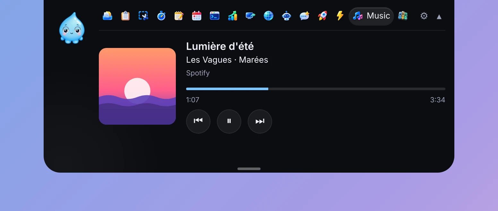</p>

---

Ondine lives at the top of your screen, like an iPhone's Dynamic Island. Move
the mouse up: a pill appears, with Ondine, a little water drop that reacts to
what happens. Click: the island opens onto your tools (music, clipboard,
screenshots, timer, calendar, notes, AI agents, network tools…), without
switching windows.

Free, open source (MIT), **no telemetry**, in English and French.
The intro video is on the website: [ondine.pissits.com](https://ondine.pissits.com).

## Contents

- [What's new](#whats-new)
- [Install](#install)
- [Getting started](#getting-started)
- [The tabs](#the-tabs): [Music](#music) · [Controls](#controls) · [Shelf](#shelf) · [Clipboard](#clipboard) · [Capture](#capture) · [Timer](#timer) · [Notes](#notes) · [Calendar](#calendar) · [Terminal](#terminal) · [System](#system) · [Remote access](#remote-access) · [Network](#network) · [AI agents](#ai-agents) · [Talk to Ondine](#talk-to-ondine) · [Launcher](#launcher) · [Rules](#rules)
- [No tab: Breaks, Weather and Weekly summary](#no-tab-breaks-weather-and-weekly-summary)
- [Settings](#settings)
- [Privacy and security](#privacy-and-security)
- [Build from source](#build-from-source)
- [License and credits](#license-and-credits)

---

## What's new

New in version 1.2.0 (the full list is in the
[CHANGELOG](CHANGELOG.md)). Click a picture to read the details.

<table>
<tr>
<td width="50%" valign="top"><a href="#mascot">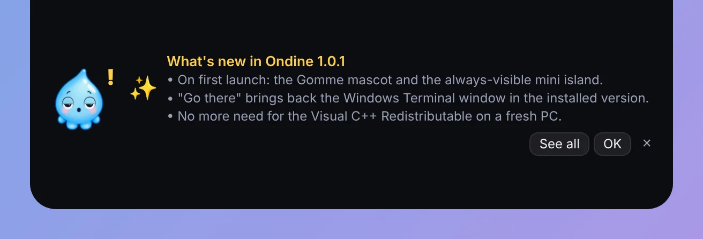</a><br><b><a href="#mascot">Fifteen gummy mascots</a></b>: twelve new cousins of the drop, plus Sky and Weather; "What's new" shows them live, and "Adopt" switches right away.</td>
<td width="50%" valign="top"><a href="#ai-agents">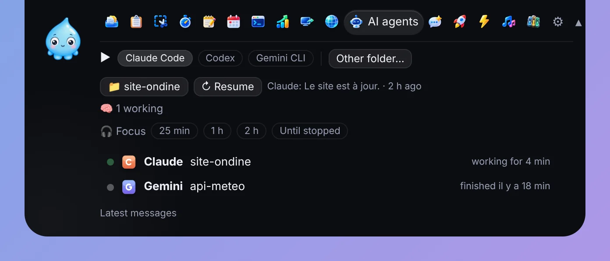</a><br><b><a href="#ai-agents">Twelve AI tools</a></b>: GitHub Copilot CLI, Cursor CLI, Qwen Code, Goose, OpenCode, Kiro CLI, Hermes, Aider and Amp join Claude Code, Codex and Gemini CLI; "Other tool" launches yours.</td>
</tr>
<tr>
<td width="50%" valign="top"><a href="#ai-agents">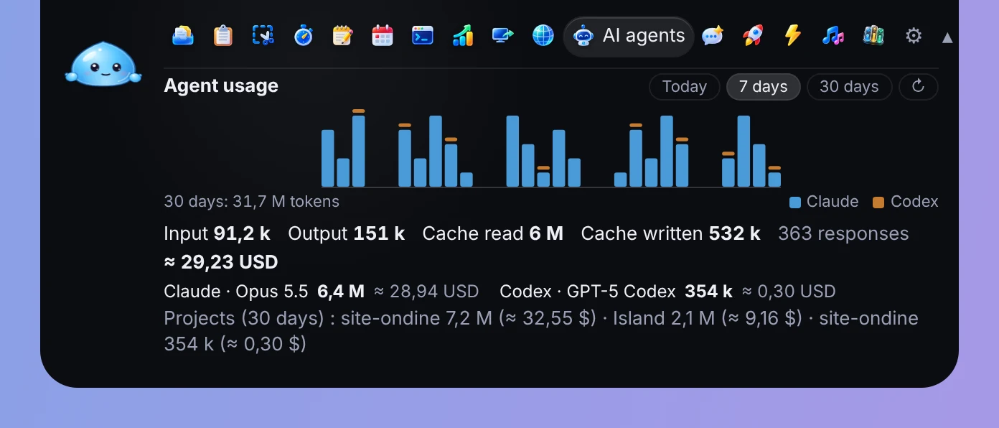</a><br><b><a href="#ai-agents">Tokens and cost</a></b>: a 30-day chart, an estimated cost from an editable price grid, a daily budget alert and a CSV export.</td>
<td width="50%" valign="top"><a href="#ai-agents">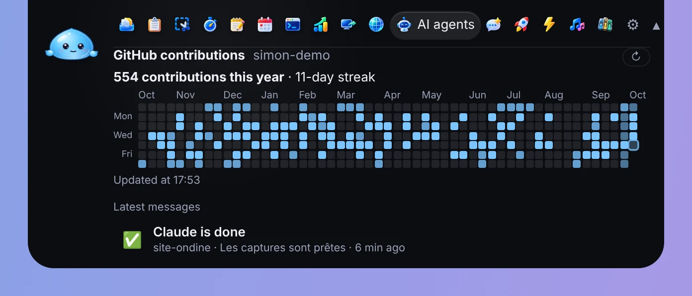</a><br><b><a href="#ai-agents">GitHub calendar</a></b>: the year's grid in the AI agents tab, with the current streak; the mascot celebrates 7, 30 and 100-day streaks.</td>
</tr>
<tr>
<td width="50%" valign="top"><a href="#ai-agents">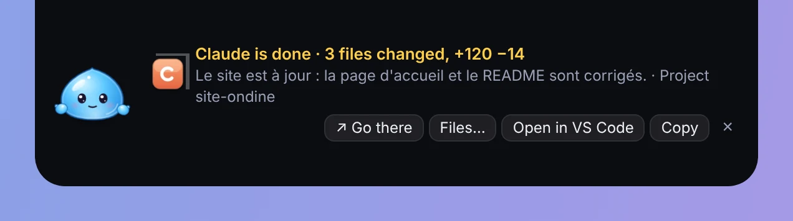</a><br><b><a href="#ai-agents">When an agent is done</a></b>: its last sentence with "Copy", and "Files…" for the list of changed files.</td>
<td width="50%" valign="top"><a href="#ai-agents">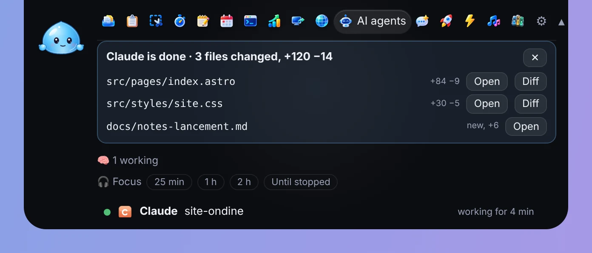</a><br><b><a href="#ai-agents">The clickable git summary</a></b>: each changed file with "Open" (VS Code) and "Diff" (the comparison with the committed version).</td>
</tr>
<tr>
<td width="50%" valign="top"><a href="#settings">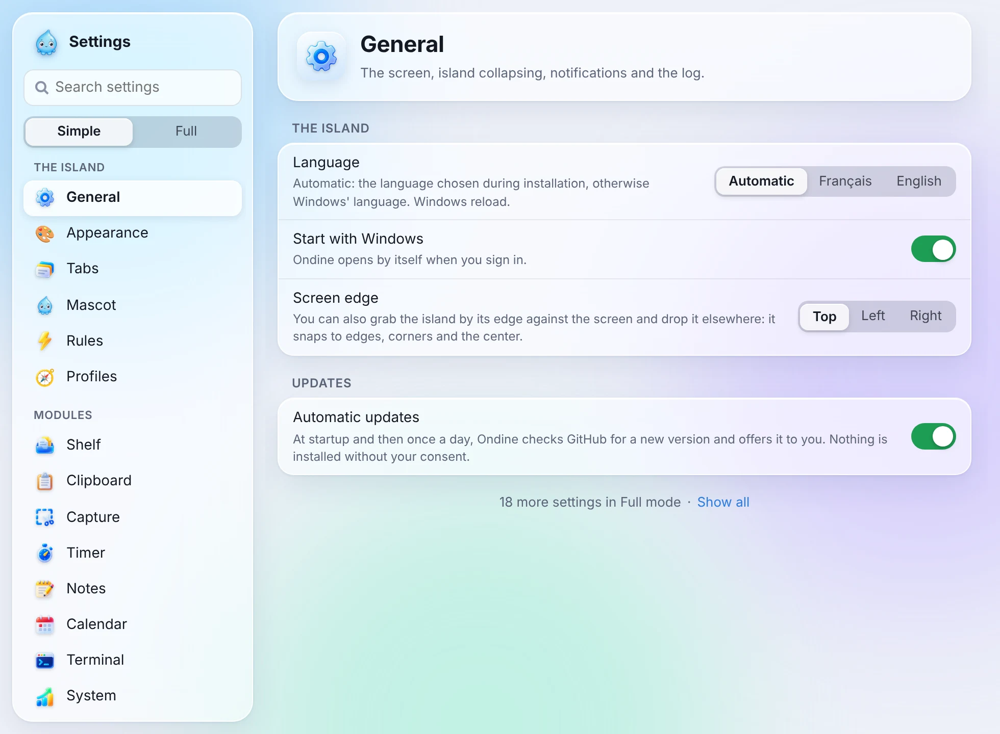</a><br><b><a href="#settings">Simple or Full settings</a></b>: by default, each page only shows the essentials; "Show all" or the switch goes to Full. Search still finds everything.</td>
<td width="50%" valign="top"><a href="#mascot">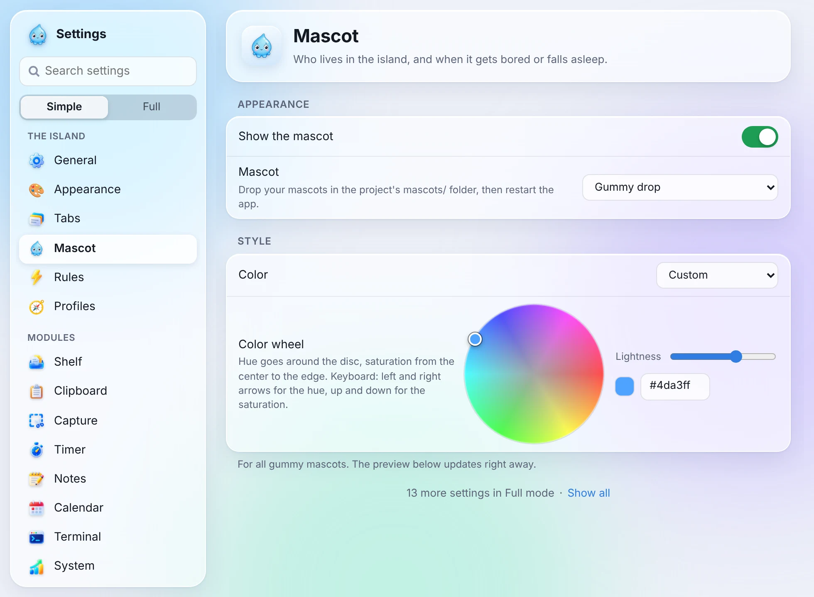</a><br><b><a href="#mascot">Color wheel</a></b>: a "Custom" color for the gummy mascots, picked on a hue / saturation wheel; the preview and the island follow along.</td>
</tr>
<tr>
<td width="50%" valign="top"><a href="#mascot">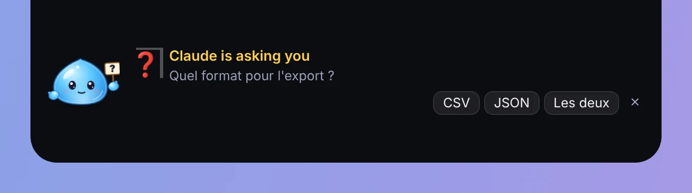</a><br><b><a href="#mascot">The mascot reacts</a></b>: a "?" sign while an agent waits for an answer, starry eyes for a received file, arms up when the timer ends, an umbrella when it rains…</td>
<td width="50%" valign="top"><a href="#no-tab-breaks-weather-and-weekly-summary">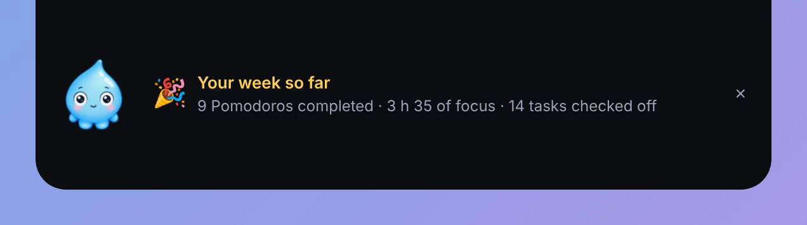</a><br><b><a href="#no-tab-breaks-weather-and-weekly-summary">Agents in the weekly summary</a></b>: tasks finished, waiting time, tokens and cost, the week's projects, from a history kept 7 days on the PC.</td>
</tr>
</table>

Also:

- **Mascot**: **Size** (Small, Normal, Large) and **Calm** (fewer spontaneous gestures) settings; hands, accessories and twelve more expressions for the gummy mascots; the two old image-based drops are gone ([Mascot](#mascot)).
- **Jelly island**: it dents under a click, swells on hover and absorbs the shock of an alert; **Island elasticity** setting (Soft, Normal, Jelly) in [Appearance](#appearance). **Animated mini island**: the music title bobs to the beat, an alert makes the island hop.
- **AI agents**: a reminder when an agent has been waiting for 10 then 30 minutes; four more MCP tools (note, shelf, screenshot, open a link); the last 7 days' history restored at startup ([AI agents](#ai-agents)).
- **Website**: a gallery of the fifteen mascots, drawn by the app's engine ([ondine.pissits.com](https://ondine.pissits.com)).

---

## Install

1. Open the [latest release](https://github.com/Naod6473/Ondine/releases/latest)
   and download **`Ondine_<version>_x64-setup.exe`**.
2. Run it. The installer offers English or French; Ondine uses that language
   on first launch. It installs for your account only: no administrator rights
   needed.
3. The installer is not signed with a code-signing certificate (they cost
   money, and Ondine is a free project). Windows will therefore probably show
   **"Windows protected your PC"** (SmartScreen): click **More info**, then
   **Run anyway**. The message only means Windows does not know the
   publisher, not that a problem was found. The installer is built
   by GitHub Actions from this repository's public source code
   ([release.yml](.github/workflows/release.yml)).

**Coming soon: `winget install Naod6473.Ondine`** — *not available yet*: the
package hasn't been submitted to Microsoft's winget catalog yet. In the
meantime, use the installer above.

On first launch, Ondine says hello at the top of the screen and explains how to
open it. It then starts with Windows (setting **Start with Windows**).

### Updates

At startup and then once a day, Ondine checks GitHub for a new version and
offers it to you; **nothing is installed without your consent**. You can also
check right away (Settings → General → Updates → **Check now**) or turn the
check off (**Automatic updates**). Updates are verified with a signature
(Tauri's update key) before they are installed.

On the first launch after an update, the island shows **"What's new in Ondine
X.Y.Z"** once: the version's main changes (taken from the
[CHANGELOG](CHANGELOG.md), built into the app), and **See all**, which opens the
version's page on GitHub. When the version brings new mascots, the panel shows
them live, three at a time: click one, then **Adopt**, and the island switches
mascot right away. To see it again: Settings → General → About → **See what's
new** (or the "What's new" scene of demo mode).

<p align="center"></p>

### Uninstall

Windows Settings → **Apps** → **Installed apps** → Ondine → **Uninstall**.
Uninstalling also removes the start-with-Windows entry. Your settings and notes
stay in `%APPDATA%\Ondine` and the log in `%LOCALAPPDATA%\Ondine`: delete those
folders to erase everything. An API key, if you added one, can be removed from
Settings → Credentials (before uninstalling) or from the Windows Credential
Manager.

---

## Getting started

<p align="center">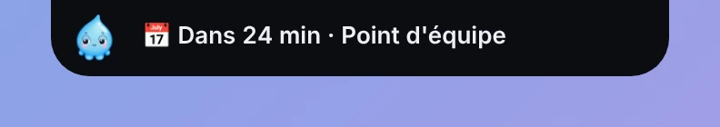</p>

| To… | Do… |
|---|---|
| Show the island | Move the mouse to the **top center of the screen**: a small line, then the pill (the "mini island") |
| Open the island | **Click** the pill, or press **Ctrl+Alt+O** anywhere (press again to close) |
| Open the launcher | **Alt+Space** (search apps, files, notes…) |
| Close | Move the mouse away (the island folds after 1.5 s), or **Esc** |
| Switch tabs | Click an icon at the top of the island; ← → keys work too. Drag an icon to reorder |
| Drop a file | Drag it onto the island: the targets appear (shelf, Recycle Bin, favorites, compress…) |
| Move the island | Grab it by the edge touching the screen and drop it elsewhere (top, left, right) |
| Open settings | The **⚙** button at the top right of the island, or Ondine's icon near the clock (right-click → Settings) |
| Quit | Icon near the clock → **Quit** |

The pill shows what matters right now: the track playing, the timer, the next
meeting, the weather, or a notification (an AI agent that finished, a
downloaded file…). The music title bubble bobs to the beat, and an incoming
alert makes the island hop.

<p align="center">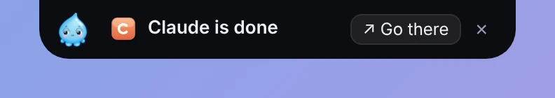</p>

When the island is hidden and you haven't touched the PC for a while, Ondine
sometimes hangs down from the top of the screen, upside down, then climbs back
(Settings → Mascot).

<p align="center">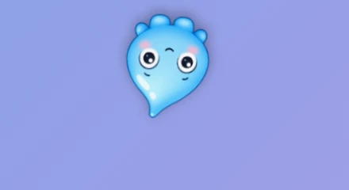</p>

**Demo mode.** Settings → General → Screenshots → **Demo mode**: the island
shows fake data (music, calendar, notes, clipboard…) instead of yours, and no
action is really performed. Handy for screenshots or a demo; every picture on
this page was made that way (the fake data itself is in French). Buttons also
play scenes ("Claude is done", "File downloaded"…). Remember to turn it off
afterwards.

---

## The tabs

Each tab is a module. You can turn them off, reorder them (Settings → Tabs) and
adjust each one in its Settings page. Below, each module's main settings, with
their default value.

The first time you open a tab, a small bubble from Ondine explains its main
gesture in one sentence ("Drag a file onto the island to put it here."); **OK**
closes it. See [Settings → Tabs](#tabs).

### Music

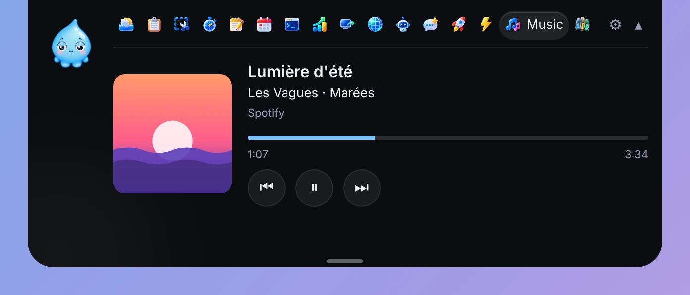

What's playing right now (Spotify, a browser, VLC… anything shown in the
Windows media panel): artwork, play/pause, previous, next, clickable progress
bar. Ondine only reads what Windows already exposes.

- **Show the island when a new track starts** (on)
- **Show the track in the island's pill** (on), with **previous / play / next buttons** (on)

### Controls

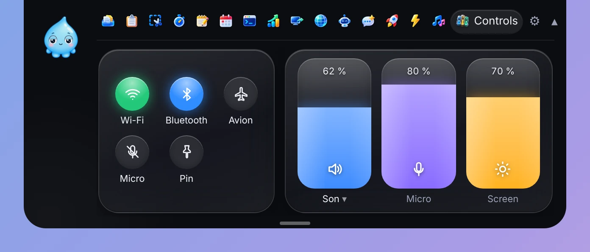

Speaker and microphone volume, screen brightness, Wi-Fi, Bluetooth and airplane
mode, without opening Windows settings. The audio output is picked under the
volume slider. External monitors must accept DDC/CI (often enabled in their
menu).

Two more toggles: **Dark** switches Windows between dark and light mode (apps
and taskbar together), **Night light** turns Windows night light on or off. If
Ondine doesn't recognize how your Windows stores the night light setting, it
leaves it alone and opens the Settings page instead.

**USB drives and removable disks**: when a USB drive (or USB disk) is plugged
in, a strip at the bottom of the tab shows it with its name, its letter and an
**Eject** button (Windows' "Safely remove hardware" method). If a program
still has it open, Ondine names it when Windows knows (for example
WINWORD.EXE), otherwise it says why Windows refused.

- **Shortcut to mute / unmute the microphone**: Ctrl+Alt+M (or Ctrl+Shift+M, Alt+Shift+M, Pause, none). Works everywhere, even in a video call; Ondine wears a small badge while the mic is muted.
- **Show a dot when an app uses the microphone or camera** (on): orange for the mic, green for the camera. Nothing is recorded: Ondine only reads what Windows notes for its Privacy page.
- **Notify when a USB drive is plugged in** (on): a notification with **Open** and **Eject**.

### Shelf

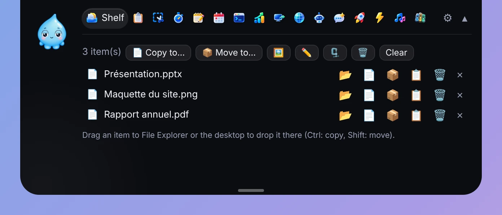

Drag files onto the island to keep them at hand. Then: copy or move them
(favorite folders included), copy their path, compress them into a .zip,
convert or shrink images, rename several files at once (with a preview), send
them to the Recycle Bin, or drag them out of the island to Explorer or the
desktop (Ctrl: copy, Shift: move). Every file action can be undone for a few
seconds.

**📱 To the phone** (on a file of the shelf): the island shows a QR code; point
the phone's camera at it and the phone's browser downloads the file. The phone
must be on **the same Wi-Fi** as the PC: Ondine opens a tiny server on the local
network only (never on the Internet), which serves that one file at a secret
address (a random 128-bit token), then closes after one complete download, after
5 minutes, or on "Stop". The first time, Windows may ask you to allow Ondine on
**private networks**: accept, otherwise the phone won't find the PC.

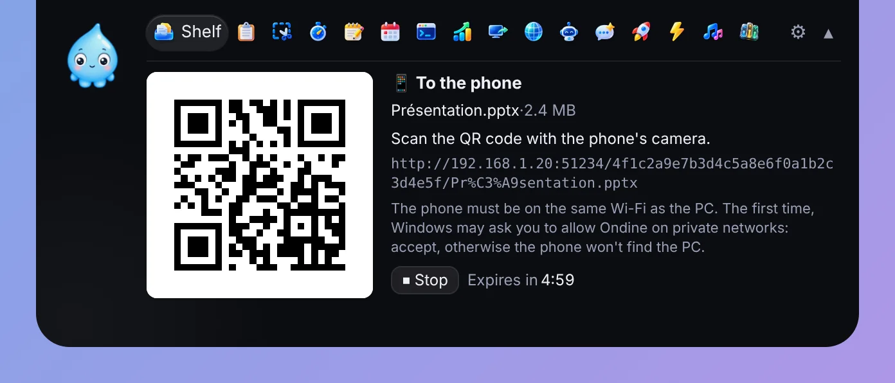

- **Favorite folders**: each becomes a target when you drag files onto the island; **Dropping on a favorite** copies (default) or moves.
- **"Recycle Bin", "Compress", "Images" and "Rename" targets** (on)
- **"Hash" target (SHA-256)** (on): drop a file on it to compute its SHA-256 (a multi-GB ISO works, with **Stop**). If the clipboard contains a hash (MD5, SHA-1, SHA-256 or SHA-512, alone or in a `sha256sum` / `certutil` list), the same algorithm is computed and the island says **Identical ✓** (green) or **Different ✗** (red). The full result is shown, with **Copy**; 5 files at most at a time.
- **Put each newly downloaded file on the shelf** (on): the Downloads folder is checked every 3 seconds.

### Clipboard

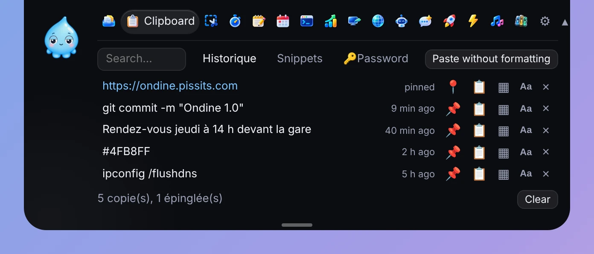

Your text copy history, with search and pinning; **Paste without formatting**;
**snippets** (your frequent texts); the **Aa** button to change case; a QR code
of a copy; a **password** generator (copied secretly, cleared from the
clipboard after 30 s, never saved). Copies that Windows flags as sensitive
(password managers) are ignored. The history stays in memory and is gone when
Ondine closes; only pinned items and snippets are saved.

A button shows up on a copy it can read: **Decode** for a **JWT** (header and
payload as readable JSON, `iat` / `nbf` / `exp` dates spelled out; the
signature is **not** verified), **Base64** that gives text, or an encoded
address (`%20`); **Format** for compact JSON; **Read the date** for a Unix
timestamp (10 or 13 digits). The result is shown in the tab, with **Copy**;
everything happens on your PC and nothing is written to the log.

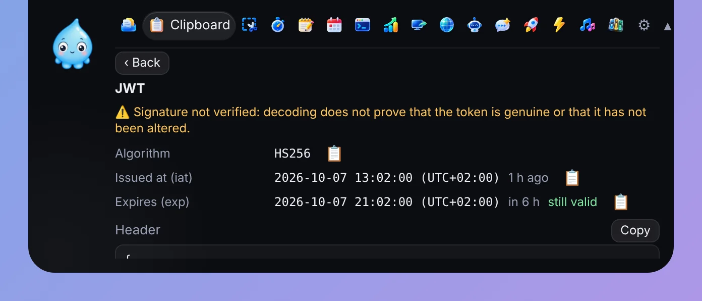

- **Number of copies kept**: 50 (10 to 500; pinned items don't count)
- **Clean copied links** (on): removes `utm_source`, `fbclid`, `gclid`…; the notification offers to restore the original.

### Capture

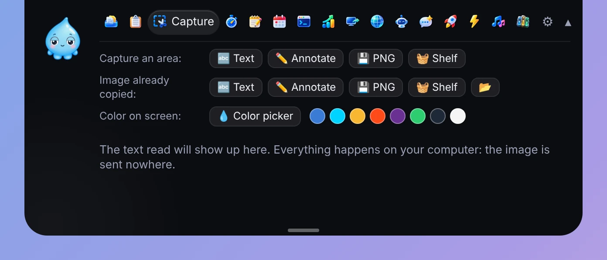

Capture an area of the screen with the Windows tool, then: **Text** (the text
in the image is read by Windows OCR, on your PC, offline), **Annotate** (arrow,
rectangle, pen, highlighter, text), **PNG** (save) or **Shelf**. The same
actions work on an image you already copied. The **color picker** freezes the
screen under a magnifier and copies the color of a point; recent colors stay
one click away.

**Record a GIF**: draw an area of the screen (a simple click takes the whole
screen, Esc cancels); it is filmed at 10 frames per second, with a red frame
around it, until **Stop** or the maximum length. The animated GIF goes to the
screenshot folder and onto the shelf (**Show in Explorer**, **Undo**). An area
wider than 960 pixels is scaled down; the island doesn't show up in the GIF
(Windows 10 version 2004 or later). No MP4 video.

- **Copy the recognized text to the clipboard** (on)
- **Screenshot folder**: `Pictures\Ondine` by default
- **Copied color format (color picker)**: HEX (`#3A7BD5`), RGB or HSL
- **Maximum GIF length**: 10 seconds (2 to 30)
- **Show the mouse pointer in GIFs** (on)

### Timer

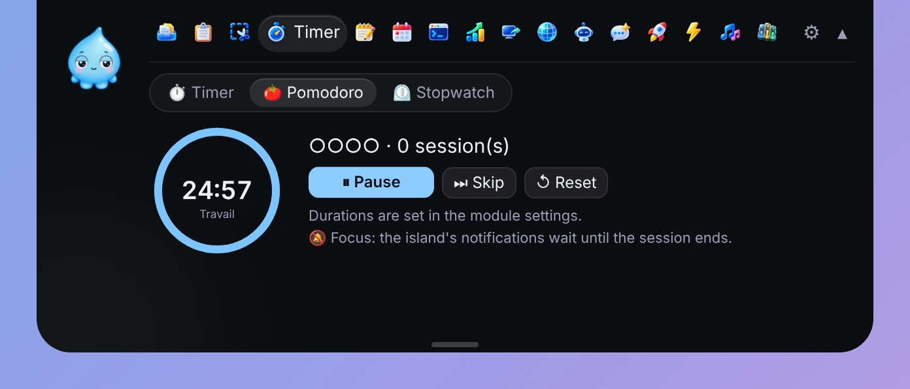

Timer (ready-made durations from 1 to 45 min), **Pomodoro** and **stopwatch**.
The time left shows in the pill, and the island tells you (with a little sound)
when it's over. From the launcher, type "10 min" to start a timer.

**Focus mode**: during a Pomodoro work session, the island's notifications wait
(except urgent ones) and arrive at the break, with a summary. Windows banners
are not silenced (for that, start a "Focus" session in the Windows 11 Clock
app).

Pomodoro work sessions count toward the
[weekly summary](#no-tab-breaks-weather-and-weekly-summary).

- **Pomodoro**: work 25 min, short break 5 min, long break 15 min every 4 sessions; **chain work and breaks automatically** (on)
- **Play a sound at the end** (on), **Show the time in the island's pill** (on), **Focus mode during Pomodoro** (on)

### Notes

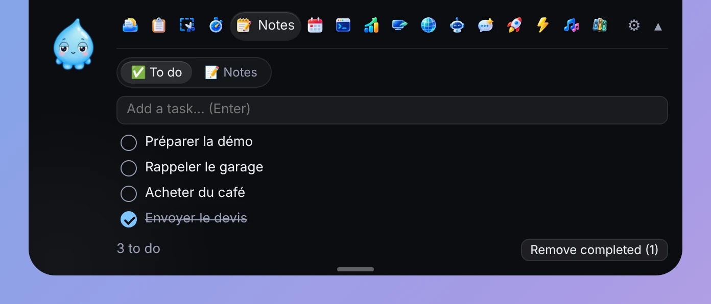

Quick notes and a to-do list, saved on your PC (`%APPDATA%\Ondine\notes.json`).
Deleting offers "Undo". Checked-off tasks count toward the
[weekly summary](#no-tab-breaks-weather-and-weekly-summary).

- **Remind me of pending tasks at startup** (off)

### Calendar

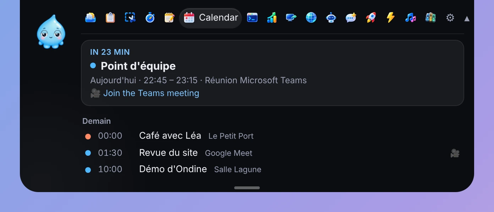

Your upcoming events from several calendars (up to 10), each with its own name
and color: an **.ics file** (exported from Outlook, Google Calendar,
Thunderbird…), re-read as soon as it changes, or the **secret iCal address** of
an online calendar, downloaded again every 15 minutes. Clicking an event opens
its link (Teams, Meet, Zoom…). Read-only; addresses are stored in the Windows
Credential Manager, never in the settings file.

Two minutes before an online meeting (Teams, Meet, Zoom, Webex), a "Meeting in
2 min" alert offers **Join**: the link opens, the music pauses, and if your mic
is muted (with the Controls tab on), a second alert says so, with **Unmute the
mic**. Only one offer per event; it replaces the reminder if both come at the
same time.

<p align="center">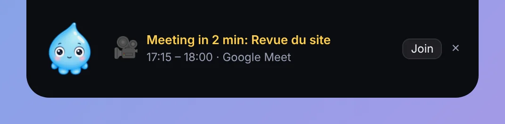</p>

- **Show events for the next**: 60 days (7 to 365)
- **Reminder before an event**: 10 min (0 = never)
- **Offer to join the meeting**: 2 min before (0 = never, up to 30)
- **Show the next event in the island's pill** (on) when it starts within 30 min
- **Evening recap**: tomorrow's events at 6 pm (0 = never)

### Terminal

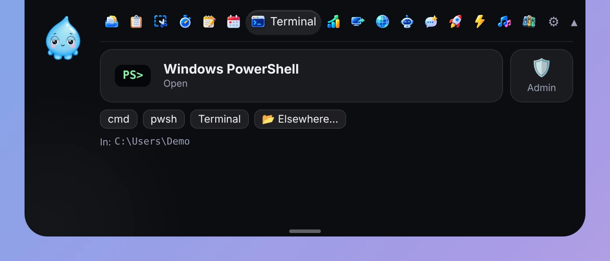

Opens cmd, Windows PowerShell, PowerShell 7 or Windows Terminal in one click, in
the folder of your choice, also **as administrator**. Drop a folder on the
island to open a terminal there. The island never types a command for you.

- **Terminal to open**: Windows PowerShell (default), cmd, PowerShell 7, Windows Terminal
- **Start folder**: your user folder by default
- **Offer "Terminal here" when a folder is dropped on the island** (on)

### System

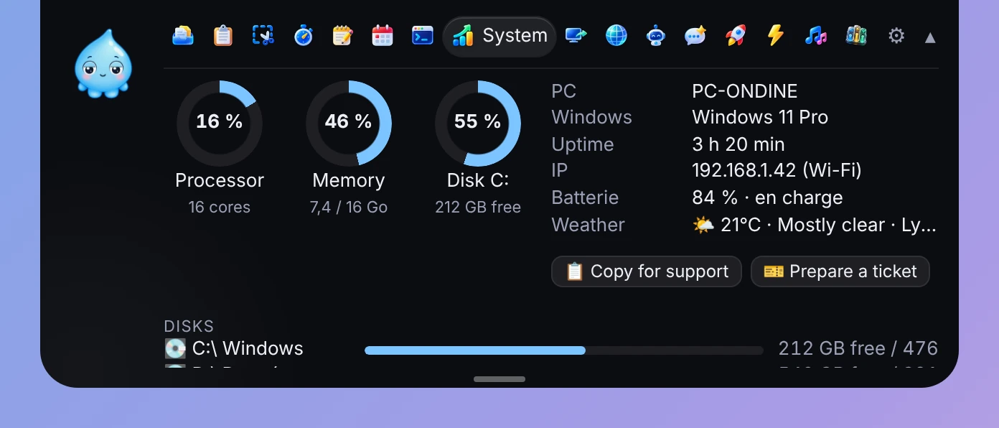

Your PC at a glance: CPU, memory, disks, IP and MAC addresses, battery, Windows
version, weather (if enabled). **Copy for support** copies a summary to paste
into a ticket. Everything is read on the PC.

When Windows is waiting for a restart (installed updates, Windows components),
a line says so: "Restart pending for 3 days (Windows updates)", with an **Open
Windows Update** button. The support summary mentions it too. Ondine never
restarts the PC itself.

- **Warn when a disk has less than** 10 % free space; **when the battery drops to** 20 %; **when the battery is charged** (on)
- **Ondine's mood follows the PC** (on): she sweats when the CPU is maxed out, gets tired when the battery is low or it's late.
- **World clocks** (empty): up to 4 cities separated by commas, for example `Montreal, Tokyo`. The tab shows the time in each, "tomorrow" or "yesterday" when the day differs, and the difference with here ("+6 h"). About 200 major cities (French or English names, accents optional) and `UTC`; an unknown city is flagged under the field. Times are computed on the PC.
- **Remind me of a pending restart** (on): a gentle notification, at most once a day, after a day of waiting, never during a call (mic in use) or a presentation.

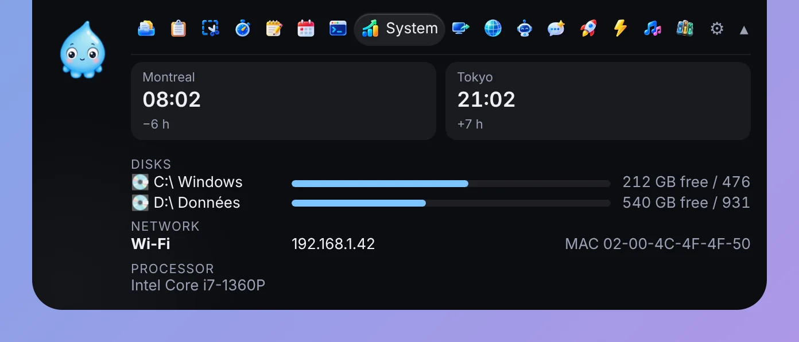

### Remote access

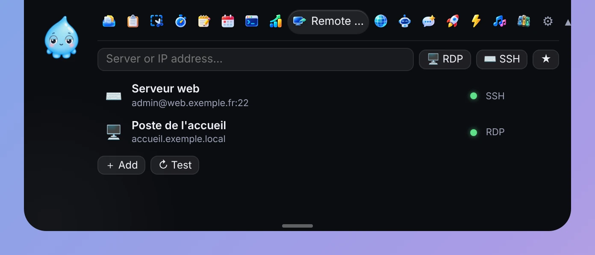

Your Remote Desktop (RDP) and SSH servers as favorites, opened in one click from
the island or the launcher. Saved on your PC (`%APPDATA%\Ondine\remote.json`),
**without any password**. "Test" only checks that the server answers.

**⏰ Wake up (Wake-on-LAN)**: give a favorite its MAC address (optional;
`AA:BB:CC:DD:EE:FF`, `AA-BB-…` or `AABBCCDDEEFF`; with the server on, `arp -a`
shows it). The ⏰ button sends the "magic packet" on the local network (on every
network card), then tests the server every 5 s for up to 2 min: the island says
"NAS is awake" as soon as it answers, or that it still isn't responding. The
launcher also offers "Wake up NAS". Wake-on-LAN must be enabled on the machine
to wake (BIOS and network card), on the same local network.

- **Open SSH in**: a console window (default) or Windows Terminal
- **Remote Desktop in full screen** (off); **Test the servers when the tab opens** (on)

### Network

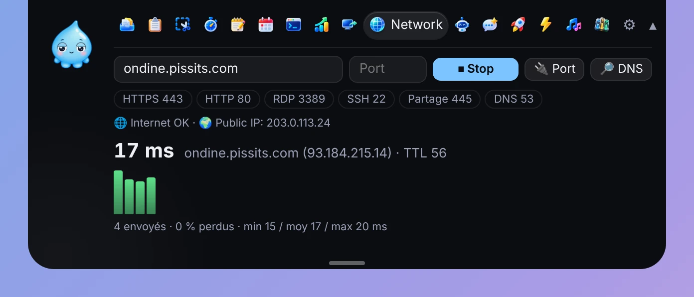

Continuous ping (with a small chart), port test (open, closed or blocked, with
shortcuts for HTTPS, RDP, SSH, file sharing…) and DNS lookup, without opening a
console. Ondine also watches the Internet connection, VPNs and a list of
servers, and tells you when something drops.

- **Notify when the Internet goes down or comes back** (on), **when a VPN disconnects or connects** (on)
- **Watch these servers**: up to 10, comma-separated (`nas.local, 192.168.1.10:443`), checked every minute
- **Monitor my public IP address** (off): the only setting of this module that contacts an outside site (api.ipify.org, every 10 min)

### AI agents


Launch **Claude Code**, **Codex**, **Gemini CLI**, **GitHub Copilot CLI**,
**Cursor CLI**, **Qwen Code**, **Goose**, **OpenCode**, **Kiro CLI**,
**Hermes**, **Aider** or **Amp** in one of your projects with one click;
**Other tool** launches the command word of your choice ("Other tool"
setting, for example `my-agent`: looked up in the PATH, never a path or an
option). A board shows running sessions; "Go there" brings the right window to
the front, Windows Terminal included. Once connected, agents notify the
island: "waiting for your permission", "finished". They go through the
`ondine.exe notify` command and a local channel reserved for your Windows
account: nothing goes over the Internet, and the island only accepts messages
from its own copy of `ondine.exe`.

**Resume**: next to each project, this button reopens the tool where you left
it (`claude --continue`, `codex resume --last`, `copilot --continue`,
`agent --continue` for Cursor, `qwen --continue`, `goose session --resume`,
`opencode --continue`, `kiro-cli chat --resume`, `hermes --continue`; no
resume for Gemini CLI, Aider or Amp), with, in small print, the last line
exchanged in Claude Code and its date ("2 h ago"). That line is read from the
end of Claude Code's session file, on your PC: it is never sent or written to
the log.

**When an agent is done**: the notification shows Claude's last sentence (read
from its transcript, on your PC, 200 characters at most), with **Copy**. In a
git repository, it also says what changed ("3 files changed, +120 −14"), with
**Files…**, **Open in VS Code** (if VS Code is installed) and **Terminal
here**. Ondine runs `git status` and `git diff --numstat` read-only, for 3
seconds at most; without git or outside a repository, the notification stays
simple.

<p align="center"></p>

**Files…** opens the tab on the list of changed files (the 20 most changed),
each with **Open** (VS Code on the file) and **Diff** (the comparison with the
committed version, in VS Code; not for a new file). Only on your click.


**When an agent has been waiting** for your answer for 10 minutes, then 30, a
reminder says so ("Claude is still waiting for your answer · for 10 min", with
"Go there"), and that's all. While the island is a pill, the mascot waves
every two minutes. Nothing during focus.

**Connect an agent in 3 steps:**

1. In the AI agents tab, open **Connect a tool**, choose the tool, then click
   **⚡ Install automatically**. Ondine adds its hooks to the tool's file
   (`%USERPROFILE%\.claude\settings.json` for Claude Code, `.codex\config.toml`
   for Codex, `.gemini\settings.json` for Gemini CLI, `.copilot\hooks\ondine.json`
   for GitHub Copilot CLI, `.cursor\hooks.json` for Cursor CLI,
   `.qwen\settings.json` for Qwen Code, a plugin in `.agents\plugins\ondine\`
   for Goose) and keeps everything else, including other programs' hooks. A
   `.bak` copy is made before each write, and **Remove** only takes out what
   Ondine added. OpenCode, Kiro CLI, Hermes, Aider and Amp launch without
   hooks; for them and for "Other tool", **Connect another tool** shows the
   line to run at the end of a task (`"…\ondine.exe" notify --source other --event done`).
2. Restart the agent, then click **Try**: a notification should appear.
3. To **allow or deny from the island** (Claude Code and Codex): turn on
   "Allow / Deny from the island" (Settings → AI agents), then click **Install
   automatically** again. The agent asks nothing in auto mode (Claude Code's
   "auto mode"): keep it in normal mode.

If the state shows **Old path** (for example after an update or after moving
Ondine), just click **Install automatically** again. Copying by hand is still
possible, under **Or by hand**.

Optionally, the island can also be added as an **MCP server** (Claude Code,
Codex, Gemini CLI): the agent can then send you a message, its progress, start
the timer, ask you a multiple-choice question, add a note, drop a file on the
shelf, ask for a screenshot, or offer to open a link or a file (always after
your click, "Capture" or "Open"; never a program). While a question waits for
your answer, the mascot holds a "?" sign: a click on her opens the tab. The
**Focus** button (25 min, 1 h, 2 h or until stopped) holds their notifications
and gives you a summary at the end. The island runs nothing the agents send it
(it only runs git, read-only, for the summary), never decides for you, and
doesn't read what you type.

<p align="center"></p>

**Agent usage** (further down the tab): the token counter, read from the
local Claude Code and Codex logs (Gemini CLI writes none) while the tab is
open: input, output, cache read, cache written and responses for today, 7 days
or 30 days, per model and per project (the folder name only). A 30-day chart
(one bar per day, per tool; hovering gives the date, the total and the day's
cost), and an **estimated cost** ("≈ 12.40 USD") from the price grid in the
settings. **Export to CSV** writes `jetons-agents-YYYY-MM-DD.csv` to Downloads
(and puts it on the shelf). Nothing leaves the PC.


**GitHub contributions**: enter your GitHub username (Settings → AI agents)
and the tab shows your contribution calendar ("336 contributions this year ·
12-day streak", the year's grid in the island's colour, lit up in a wave the
first time). It is the only feature of the tab that talks to the Internet: at
most one request every 30 minutes to github.com, which only receives the
username; never during a presentation or focus. To count private
contributions too, a personal read-only **token** (`read:user` scope), kept in
the Windows Credential Manager. A copy of the calendar
(`%APPDATA%\Ondine\github-calendar.json`) is shown right away at startup. The
mascot celebrates 7, 30 and 100-day streaks.


The agents' history ("done", "waiting", with the tool, the project name, the
duration and the git summary; never the messages or paths) is kept for 7 days
in `%APPDATA%\Ondine\agents-history.json` and restored at startup under
"Latest messages"; it feeds the AI agents card of the
[weekly summary](#no-tab-breaks-weather-and-weekly-summary).

- **Projects for agents**: up to 8 folders, one button each (in the tab and the launcher)
- **Open agents in**: a console window (default) or Windows Terminal
- **Offer Claude Code / Codex / Gemini CLI / GitHub Copilot CLI / Cursor CLI / Qwen Code / Goose / OpenCode / Kiro CLI / Hermes / Aider / Amp** (on); **Other tool: the command word** (empty)
- **Show the session's last line next to "Resume"** (on)
- **Notify when Claude waits for my answer or permission** (on), **when Claude is done** (on)
- **Show Claude's last sentence when it is done** (on), with "Copy"
- **Show what changed when an agent is done** (on): the git summary above
- **Remind me that an agent is still waiting for my answer** (on): after 10 then 30 minutes
- **Accept MCP tools** (on)
- **Allow / Deny from the island** (**off** by default): when Claude Code or Codex asks permission to use a tool, the island shows the command with "Allow" (to confirm) and "Deny". After turning it on, reinstall the hooks (step 3 above). Without an answer within the chosen delay (1 min by default), the question goes back to the terminal.
- **The mascot thinks while Claude works** (on)
- **Count the agents' tokens** (on); **Model price grid** ($ per million tokens): one line per model, "name prefix ; input ; output ; cache read ; cache written" (the default grid is indicative: check with the vendors); **Daily budget** ($, 0 = no alert): beyond it, a notification (once a day) and the mascot worries
- **GitHub username** (empty = nothing is requested); **GitHub token** (optional)

### Talk to Ondine

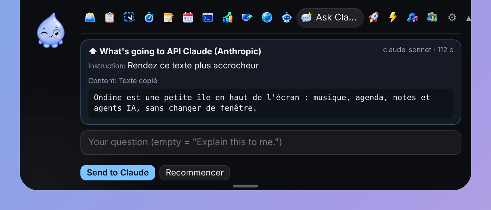

A conversation with Ondine, like in a messaging app: she answers using
**Claude** (default), **GPT** or **Gemini**, with her own little personality,
and ends each answer with a mood that the mascot acts out on the island. You can
attach a text file or a screenshot (or drop one on the island): it is shown to
you in full before it leaves. Enter sends, Shift+Enter adds a line.

**This module sends content to the chosen API** (api.anthropic.com,
api.openai.com or generativelanguage.googleapis.com), with **your** API key
(Settings → Credentials): each message sends the personality, the latest
messages of the conversation (20 at most, with their attached files) and the
new one. The tab says so under the field, and "Show the personality" shows the
exact instruction. The conversation stays in memory, never on disk: it is
erased by "Start over" or when you quit the island. Files in excluded folders
are refused. Answers are only displayed: nothing is executed.

- **AI provider**: Claude (default), GPT or Gemini. Each has its own key; you can switch at any time
- **Claude model**: Claude Sonnet 5.5 (default), Claude Opus 5.5 or Claude Haiku 4.5
- **GPT model** (empty = gpt-6-luna) and **Gemini model** (empty = gemini-3.8-flash): the exact model name at the vendor
- **Maximum length of an answer**: 1,024 tokens
- **Ondine's personality**: empty = a cheerful, curious, slightly mischievous droplet who answers in a few sentences, in the interface language; write your own to change her character
- **The island grows with the conversation** (on): up to its maximum size, then the conversation scrolls
- **Ondine shows her moods on the island** (on)
- **Offer "Talk to Ondine" when a file is dropped on the island** (on)

### Launcher

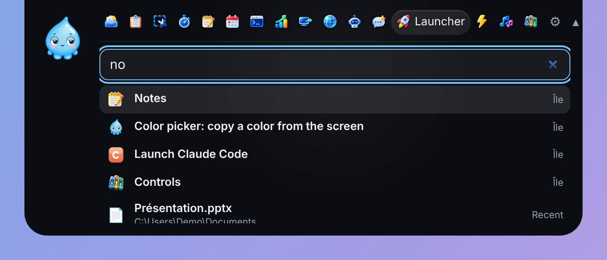

**Alt+Space** opens a search: Start menu apps, Windows tools (Services, Device
Manager…), recent files, favorite servers (and "Wake up …" for those with a MAC
address), agent projects and island actions
("10 min" starts a timer). It also searches **inside the island**: notes and
tasks, clipboard, shelf and screenshots. ↑ ↓ to choose, Enter to open.

It also **calculates**: when the search is a calculation, the answer comes first
and **Enter copies it** (small "Copied" notification).

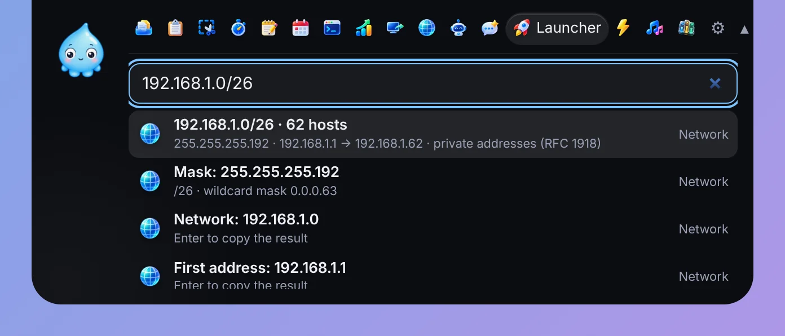

- Math: `2 + 3 * 4`, `(1.5 + 2) ^ 2`, `1,200 / 3`, `18% of 240`, `240 + 18%`, `15%` (= 0.15), `sqrt 2`. Numbers follow the interface language (in French: decimal comma, spaces between thousands).
- Units: `1 GB in MiB`, `100 Mbit/s in MB/s`, `90 min in h`, `20 °C in °F`, `10 km -> mi`, `5 lb in kg`. Bytes: KB, MB, GB, TB are powers of 1000, KiB, MiB, GiB, TiB powers of 1024 (B = byte, b = bit).
- Transfer time: `1 GB at 100 Mbit/s` → 1 min 20 s.
- Bases: `0x1F`, `0b1010`, `255 in hex`, `0xFF in decimal`, `42 in binary`.
- IPv4 subnet: `192.168.1.0/26` or `192.168.1.10 255.255.255.0` → network, mask, first and last address, broadcast, number of hosts (Enter on the first line copies the summary, on another line just that value).
- World time: `3 pm Montreal`, `15:30 in Tokyo` → "15:00 in Montreal = 21:00 here"; `time in Tokyo` → the time there. About 200 cities, computed on the PC.
- `guid`: a fresh GUID (lowercase, or Windows style `{…}` in uppercase).

- **Shortcut**: Alt+Space (or Ctrl+Space, Ctrl+Alt+Space, Ctrl+Shift+Space, Win+Shift+Space, none)
- **Offer recently opened files** (on); **Also search the island** (on, at most 5 results per source). Excluded folders are never shown.

### Rules

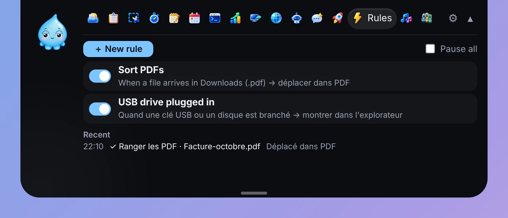

"**When… then…**" automations. When: a file arrives in a folder (with
conditions: extensions, name, size), a USB drive is plugged in or removed, a
keyboard shortcut is pressed, or an island event happens. Then: move, copy,
rename, send to the Recycle Bin, put on the shelf, show in Explorer, open a
terminal, show a notification, open a tab, start a timer, paste without
formatting. Ready-made templates are included. Every move offers "Undo",
nothing is ever permanently deleted, and **no rule can launch a program**.
Rules are created in Settings → Rules; the tab lists them with their history,
and can pause them all.

---

## No tab: Breaks, Weather and Weekly summary

<p align="center">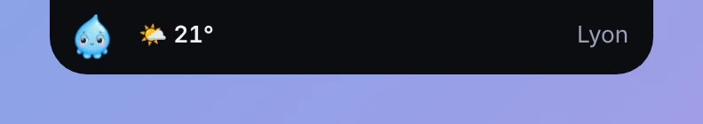</p>

**Weather**: the temperature and conditions in your city, in the mini island
when it has nothing else to show, and in detail in the System tab. **Off until
you tick "Show the weather"**: nothing goes out before that. Service:
[Open-Meteo](https://open-meteo.com) (free, no account), at most every 30
minutes; it receives the city name, then its rounded coordinates (about 1 km).
Settings: **Your city** ("Lyon" or "Lyon, FR"), **Unit** °C or °F, **In the
mini island** (on).

**Breaks**: reminds you to take a short break after a long stretch at the
screen (**every 50 minutes of screen time** by default, 0 = never). Stays quiet
during a presentation, a call (**Say nothing during a call**, on) or if you
just took a break. Ondine only looks at how long the mouse and keyboard have
been in use.

**Weekly summary**: every week, a notification sums up what you've done:
**Pomodoros completed**, **focus time** (Timer work sessions) and **tasks
checked off** in Notes, and the mascot celebrates. Only if something happened.
If the PC was off at that time, the summary comes at the next startup (within 2
days), once a week at most. The counters stay on your PC
(`%APPDATA%\Ondine\weekly.json`) and only hold numbers, never the text of your
tasks. Settings: **Summary day** (Friday) and **Summary time** (17:00); **See the
summary now** shows the current week. To stop it, turn the module off
(Settings → Tabs → No tab).

If AI agents worked during the week, an **AI agents** card is added: tasks
finished, time spent waiting on you, tokens and estimated cost, most active
projects (from the 7-day history of the [AI agents](#ai-agents) tab). The
scheduled summary still only goes out when the classic week has something;
"See the summary now" also shows it with agents only.

<p align="center"></p>

---

## Settings

The settings window opens from the island's ⚙ button or from the icon near the
clock. A search box at the top left finds any setting. Each module has its own
page (on/off switch, permissions, full description, settings).

Under the search box, the **Simple / Full** switch: in **Simple** (the
default), each page only shows the essentials, and a "N more settings in Full
mode · Show all" line ends the page; in **Full**, everything is there, in the
same place. Search still finds everything: a result hidden in Simple is
labelled "advanced setting", and going to it switches to Full. The lists below
give all the settings (Full mode).


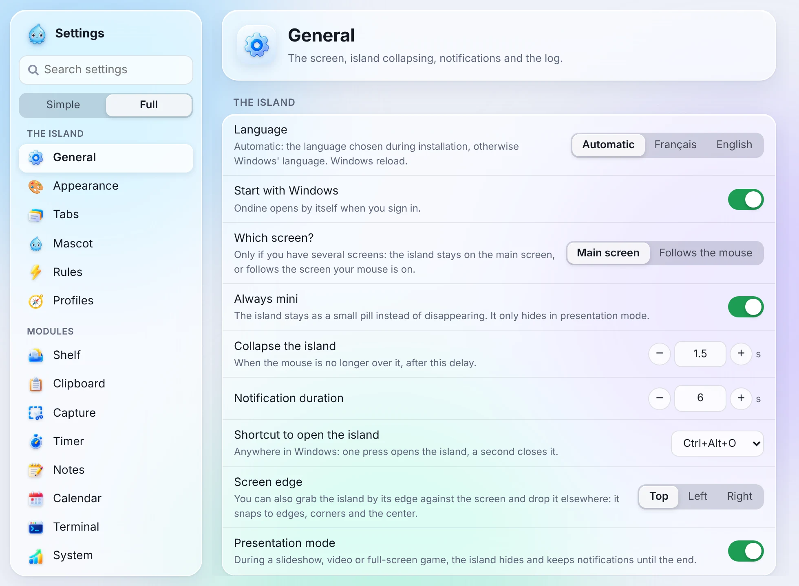

### General

- **Language**: Automatic (the language chosen during installation, otherwise Windows'), Français or English
- **Start with Windows** (on)
- **Which screen?**: the main screen, or the one the mouse is on
- **Always mini** (off): the island stays a pill instead of disappearing
- **Collapse the island** after 1.5 s; **Notification duration**: 6 s
- **Shortcut to open the island**: Ctrl+Alt+O (or Ctrl+Shift+O, Alt+Shift+O, Ctrl+Alt+I, none)
- **Screen edge**: top, left or right
- **Presentation mode** (on): during a slideshow, a video or a full-screen game, the island hides and keeps notifications for later
- **Updates**: automatic (on), check now, installed version
- **Performance**: High performance, **Balanced** (default) or Power saving; **Automatic power saving on battery** (on)
- **Log**: level and folder (`%LOCALAPPDATA%\Ondine\logs`); it never contains keys or file contents
- **About**: **See what's new** shows the installed version's "What's new" again; **Report a problem** opens a prefilled GitHub issue in your browser (version, Windows, last 40 log lines, personal paths hidden); you review everything before sending. **Resources used**: Ondine's memory and CPU.
- **Screenshots**: [demo mode](#getting-started)

### Appearance

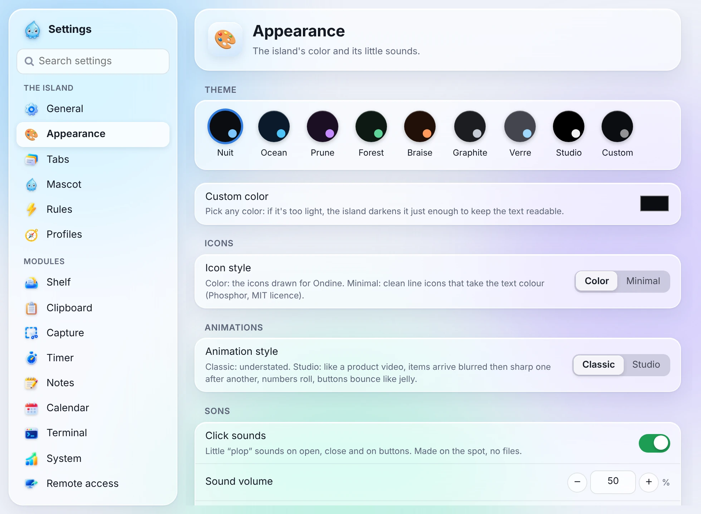

- **Theme**: Nuit (default), Ocean, Prune, Forest, Braise, Graphite, Verre, Studio, or a **custom color** (if it's too light, the island darkens it just enough to stay readable)
- **Icon style**: **Color** (icons drawn for Ondine) or **Minimal** (line icons that take the text color; Phosphor)
- **Animation style**: **Classic** (understated) or **Studio** (items arrive blurred then sharp, numbers roll, buttons bounce)
- **Island elasticity**: **Soft** (it settles without bouncing), **Normal** (a small bounce, default) or **Jelly** (it wobbles, dents under your clicks and stretches like marshmallow). The island changes shape with springs that keep their momentum, swells on hover and absorbs the shock of an alert.
- **Click sounds** (on) and their volume; sounds are generated on the fly, no files

Animations respect Windows' "Animation effects" (reduce motion) setting.

### Tabs

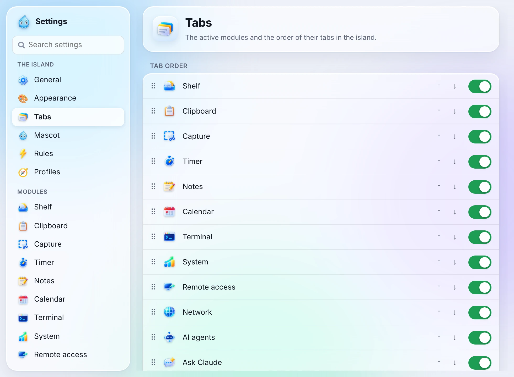

Turn each module on or off, and order the tabs (drag a row, or use ↑ ↓;
"Original order" resets it). You can also drag tabs directly in the island.

- **Tips the first time a tab opens** (on): the small bubble that explains a tab's main gesture, the first time only (never in demo mode or over an alert)
- **Show the tips again**: they'll come back the next time each tab opens

### Mascot


Show the mascot or not, and which one: the **Gummy drop** (default) or one of
its fourteen cousins (Marshmallow, Sugared almond, Berlingot, star, sun, moon,
cloud, heart, flower, mushroom, ghost, flame, **Sky** — sun by day, moon at
night — and **Weather**, which follows the current weather; you can add your
own in the `mascots/` folder, see [mascots/README.md](mascots/README.md)). The
two old image-based drops ("Goutte" and "Goutte classique") are gone: a
setting that still named them falls back to the gummy drop. A preview lets
you try all her animations.

She reacts to what happens: starry eyes when a file lands on the shelf, arms
up when the timer ends, a wink when the clipboard cleans a link, proud of a
screenshot, a wave to the ejected USB stick, worried when the disk is nearly
full or the agents' budget is exceeded; mittens on the ears during focus, an
umbrella when the Weather announces rain, and a "?" sign while an agent waits
for your answer (a click on her opens the AI agents tab). She **gets bored**,
then **falls asleep** when nothing happens; she can **hang over the screen
edge** (at most one visit every N minutes, never during a presentation).

**Ondine on the desktop**: she can leave the island and live wherever you like
on the desktop, just the mascot. Drag her out of the island (or turn on
"Ondine lives on the desktop"), then grab her to move her: her place is
remembered. A click on her opens a bubble next to her with a few of the
island's tabs (Talk to Ondine, Launcher and AI agents by default, chosen in the
same group), and the bubble follows her when she moves. She dances, cheers,
worries and sleeps just like in the island; notifications stay in the island.
"Above windows" (on); otherwise she stays behind them, on the wallpaper. The
To bring her home: drag her onto the island, or use the ⤒ button in her
bubble or the 💧 button of the open island. She steps out during a
presentation or full screen, then comes back. Dropped near a screen edge or
the taskbar, she sits on it. Drop a file on her: her bubble offers the
island's targets (Talk to Ondine, Shelf…). A notification arrives in the
island: a badge appears on her (a click opens the island). **Ctrl+Alt+B** opens
her bubble (configurable), the menu of the icon near the clock moves her out or
back in, and when you leave the PC alone she takes a few steps ("She wanders
around…" setting).

- **Size**: Small, Normal (default) or Large, in the open island and the preview; the mini island keeps its size.
- **Style** (gummy mascots): **Color** (the shape's own, a tint, Rainbow, or **Custom**: a hue / saturation wheel, a lightness slider and the value to type; the preview and the island follow the drag), **Hands** (always, only for gestures, never), hat, glasses and necklace.
- **Mood**: **Gets bored after** and **Falls asleep after**; **Calm: fewer spontaneous gestures** (off): no more boredom, snack, edge visits, dancing or module reactions; she still reacts to AI agents (waiting, question), errors, successes, alerts, and she sleeps.
- **Edge visits**: **Ondine comes to hang over the edge** (on), **at most one visit every** N min, **Bring Ondine over** to try.

### Profiles

"Work", "Home"… A profile switches the visible tabs and their order, the island
color and "Always mini" in one go. Pick it in the settings or from the menu of
the icon near the clock; it can also **switch automatically**, by days and
hours, or by Wi-Fi network name.

### Privacy, Credentials, Backup

- **Privacy**: a reminder of the island's promises (no telemetry, anything going to an AI is always shown first) and **excluded folders**: no module will read or send a file in these folders (not the launcher, the shelf, nor Talk to Ondine).
- **Credentials**: the **Anthropic API key**, stored in the Windows Credential Manager. The island can only tell whether a key exists: it can never display it again.
- **Backup**: **export** your settings to a .json file (`%APPDATA%\Ondine\exports`) or **import** them. Keys are never part of the export.

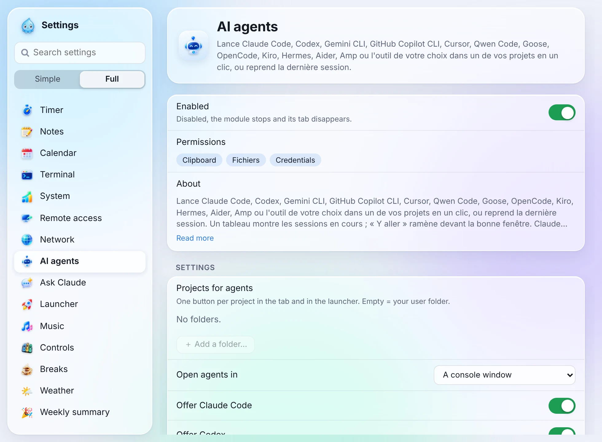

---

## Privacy and security

- **No telemetry**: no analytics, no crash reports, no account.
- The only automatic connection: once a day, Ondine asks GitHub whether a new
  version exists (can be turned off). Everything else (Talk to Ondine, iCal links,
  weather, public IP, ping…) only happens when you enable or request it. The
  full list: [PRIVACY.md](PRIVACY.md#english).
- Talk to Ondine sends your messages (and the files you attach, after showing
  them to you) to the chosen API (Claude, GPT or Gemini), with **your** key.
- "To the phone" (Shelf) and "Wake up" (Remote access) stay on the local
  network, only when you click: nothing goes over the Internet.
- The GitHub calendar (AI agents) only fetches when you enter your username:
  at most every 30 minutes, github.com receives the username alone (or, with a
  `read:user` token, api.github.com). The agents' logs and the token counter
  are read locally, never sent.
- Keys and secret links are stored in the Windows Credential Manager, never in
  plain text in a file or in the log.
- Nothing is ever deleted for good: the Recycle Bin, with undo.
- Found a vulnerability? Please report it privately: [SECURITY.md](SECURITY.md#english).

### Signing

The installer and `Ondine.exe` are not Authenticode-signed (hence the
SmartScreen warning on install). They are built only by GitHub Actions from this
repository. Automatic updates are signed (minisign): Ondine rejects any update
whose signature does not match the key embedded in the app. Details:
[CODE_SIGNING.md](CODE_SIGNING.md).

---

## Build from source

Ondine is built with [Tauri 2](https://tauri.app): Rust for the system side,
framework-free TypeScript for the interface.

**Requirements (Windows 10 or 11)**

- [Node.js](https://nodejs.org) 20 or newer
- [Rust](https://rustup.rs) (stable)
- Visual Studio Build Tools with the **"Desktop development with C++"** workload (MSVC build tools)
- WebView2 (already on Windows 11 and up-to-date Windows 10; otherwise, the [Evergreen runtime](https://developer.microsoft.com/microsoft-edge/webview2/))

**Run, build, test**

```powershell
git clone https://github.com/Naod6473/Ondine.git
cd Ondine
npm ci                       # dependencies, exactly as in package-lock.json
npm.cmd run tauri dev        # the full app, reloaded on every change
npm.cmd run tauri build      # the installer: src-tauri\target\release\bundle\nsis\Ondine_<version>_x64-setup.exe
```

`src-tauri\target\release\ondine.exe` also runs without installing.
`npm.cmd` avoids PowerShell's "running scripts is disabled" error; if `npm`
works for you, it's the same.

`npm run dev` alone opens the island in a browser (http://localhost:1420, and
http://localhost:1420/settings.html for the settings): useful for working on
the look, without the Windows features.

```powershell
npm run typecheck                    # TypeScript
npm test                             # interface tests (island, settings, translations)
cd src-tauri; cargo test; cd ..      # Rust tests
```

To go further: [CONTRIBUTING.md](CONTRIBUTING.md) (project rules,
translations, file locations) and [docs/ARCHITECTURE.md](docs/ARCHITECTURE.md)
(code layout, modules, bus, settings). These documents are in French. Version
history: [CHANGELOG.md](CHANGELOG.md).

---

## License and credits

Ondine is released under the **MIT** license: see [LICENSE](LICENSE).

- "Minimal" icons: [Phosphor Icons](https://phosphoricons.com) (MIT).
- Win32 tricks adapted from [Coucou](https://github.com/Louis-CFM/coucou) (MIT).
- Music of the intro video: *Lovely Swindler*, Amarià (CC BY 3.0).
- Everything that comes from elsewhere, with licenses: [THIRD-PARTY.md](THIRD-PARTY.md).

Claude, Gemini, Codex, GitHub Copilot, Cursor, Qwen, Goose, OpenCode, Kiro,
Hermes, Aider and Amp are trademarks of their owners; Ondine is not affiliated
with any of them.
