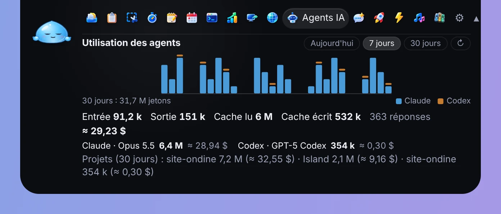
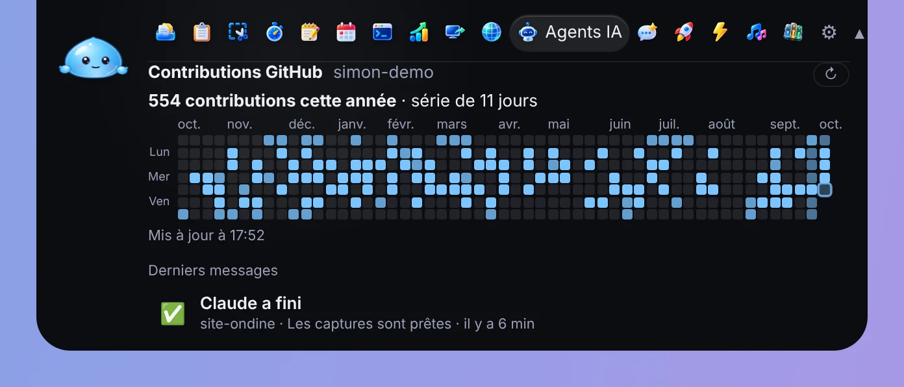
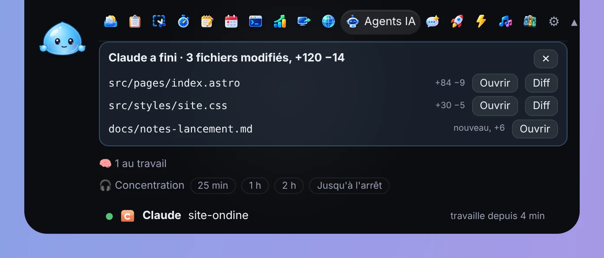
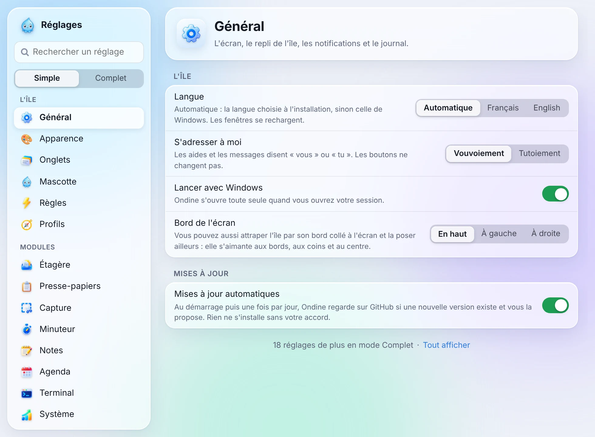
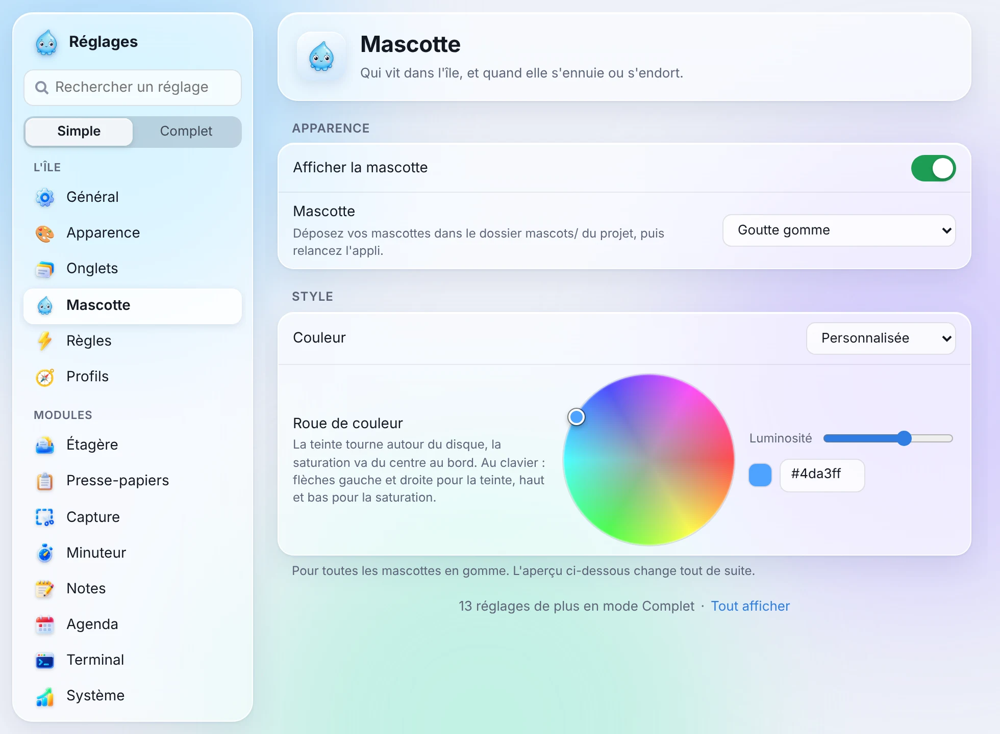
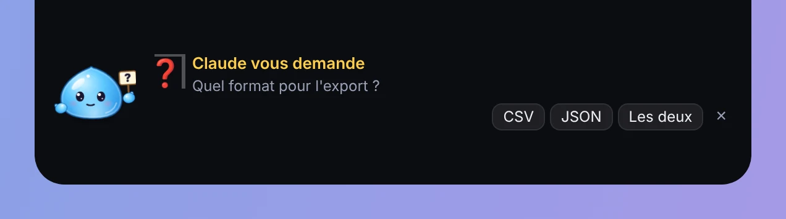

<p align="center"></p>

<h1 align="center">Ondine</h1>

<p align="center">
<b>Une île au sommet de l'écran pour Windows 10 et 11.</b><br>
<i>A little island at the top of your Windows screen.</i>
</p>

<p align="center">
<a href="https://ondine.pissits.com"><b>ondine.pissits.com</b></a> ·
<a href="https://github.com/Naod6473/Ondine/releases/latest">Télécharger</a> ·
<a href="README.en.md"><b>English version</b></a>
</p>

<p align="center"></p>

---

Ondine vit en haut de l'écran, comme l'île dynamique d'un iPhone. Approchez la
souris : une pilule apparaît, avec Ondine, la petite goutte qui réagit à ce qui
se passe. Cliquez : l'île s'ouvre sur vos outils (musique, presse-papiers,
captures, minuteur, agenda, notes, agents IA, outils réseau…), sans changer de
fenêtre.

Gratuite, open source (MIT), **sans télémétrie**, en français et en anglais.
La vidéo de présentation est sur le site : [ondine.pissits.com](https://ondine.pissits.com).

## Sommaire

- [Nouveautés](#nouveautés)
- [Installer](#installer)
- [Premiers pas](#premiers-pas)
- [Les onglets](#les-onglets) : [Musique](#musique) · [Contrôles](#contrôles) · [Étagère](#étagère) · [Presse-papiers](#presse-papiers) · [Capture](#capture) · [Minuteur](#minuteur) · [Notes](#notes) · [Agenda](#agenda) · [Terminal](#terminal) · [Système](#système) · [Accès distants](#accès-distants) · [Réseau](#réseau) · [Agents IA](#agents-ia) · [Parler à Ondine](#parler-à-ondine) · [Lanceur](#lanceur) · [Règles](#règles)
- [Sans onglet : Pauses, Météo et Bilan de la semaine](#sans-onglet--pauses-météo-et-bilan-de-la-semaine)
- [Réglages](#réglages)
- [Vie privée et sécurité](#vie-privée-et-sécurité)
- [Construire depuis les sources](#construire-depuis-les-sources)
- [Licence et crédits](#licence-et-crédits)

---

## Nouveautés

Les nouveautés de la version 1.2.2 (la liste complète est dans le
[CHANGELOG](CHANGELOG.md)) :

- **Parlez à Ondine à voix haute** : Ctrl+Alt+V (ou 🎙️), sous-titres en
  direct, le halo de l'île tremble avec votre voix. Elle répond en « plop
  plip » au rythme du texte, et sa bouche suit. Commandes rapides sans IA
  (« volume 30 », « minuteur 10 minutes »…), mains libres, « Regarde ça ». La
  dictée de Windows passe par le service en ligne de Microsoft ; la
  transcription par l'API est en option.
- **Halos de lumière** autour de l'île : vert au branchement, orange quand la
  batterie est faible, rouge critique avec Ondine qui panique, et le module
  « Animations de l'île » pour une vingtaine de moments du PC (veille, clé
  USB, météo, agents IA, rendez-vous…).
- **L'île vivante face aux fenêtres** : elle s'écarte de la fenêtre de
  réglages, peut se poser en bas de l'écran, suit le texte en hauteur et en
  largeur, et le module « Ondine et les fenêtres » la fait réagir au plein
  écran, au verrouillage, à la souris secouée…
- **Mascottes plus réalistes** : 15 nouvelles expressions pour les 15
  mascottes, reflet et pupilles qui bougent, gomme translucide, émotions
  mélangées, repos jamais identique, une couleur par mascotte sur le podium.
- **Équipe** (désactivé par défaut) : les Ondine d'un même réseau local se
  parlent sans serveur, chiffré de bout en bout : présence des collègues,
  coucous, fichiers à accepter, café, sondage, Pomodoro d'équipe, aide de l'IT
  avec accord.
- **Et aussi** : 17 nouveautés dans les Règles, batteries Bluetooth, « Bureau
  propre », télécommande sur le téléphone, surveillance de Claude, ChatGPT et
  Gemini, recherche web dans le Lanceur, île de Parler à Ondine épurée.

### Dans la 1.2.1

- **[Parler à Ondine](#parler-à-ondine)** remplace « Demander à Claude » : une
  vraie conversation dans des bulles, avec la personnalité d'Ondine
  (modifiable) et ses humeurs, que la mascotte joue sur l'île. Elle répond avec
  **Claude** (par défaut), **GPT** ou **Gemini**, une clé API par fournisseur.
  La conversation n'est jamais écrite sur le disque. C'est le premier onglet au
  premier lancement, et l'île s'agrandit avec la conversation.
- **Elle s'occupe de vos fichiers** : elle les cherche par leur nom, en lit un,
  en crée un (texte seulement, jamais écrasé) dans Documents\Ondine, ou vous
  propose d'en ouvrir un. Pour lire ou créer, elle vous montre tout et attend
  votre accord.
- **Elle agit sur le PC** quand vous le lui demandez : volume, luminosité, mode
  sombre, musique, minuteur de l'île, notes ; elle consulte l'état du PC,
  l'agenda et la météo. Ouvrir une application ou un site, poser un fichier sur
  l'Étagère, toucher au Wi-Fi ou au Bluetooth : seulement après votre accord.
  Elle ne peut rien supprimer ni lancer de commande.
- **[Ondine sur le bureau](#mascotte)** : tirez la mascotte hors de l'île et
  posez-la où vous voulez. Un clic sur elle ouvre une bulle avec vos onglets
  préférés ; elle s'assoit sur la barre des tâches, accepte les fichiers qu'on
  lui lâche, s'ouvre avec Ctrl+Alt+B et se promène quand le PC est au repos.
- **[Réglages](#réglages) plus légers** : les modules rangés en catégories
  repliables, les pages longues en sous-menus dans la barre de gauche.
- **[Le podium des mascottes](#mascotte)** : toutes les mascottes, animées, sur
  des marches en 3D ; on glisse celle qu'on veut sur la première.

### Dans la 1.2.0

Cliquez sur une image pour lire le détail.

<table>
<tr>
<td width="50%" valign="top"><a href="#mascotte"></a><br><b><a href="#mascotte">Quinze mascottes en gomme</a></b> : douze nouvelles cousines de la goutte, plus Ciel et Météo ; «&nbsp;Quoi de neuf&nbsp;» les montre en direct, et «&nbsp;Adopter&nbsp;» en change tout de suite.</td>
<td width="50%" valign="top"><a href="#agents-ia"></a><br><b><a href="#agents-ia">Douze outils IA</a></b> : GitHub Copilot CLI, Cursor CLI, Qwen Code, Goose, OpenCode, Kiro CLI, Hermes, Aider et Amp rejoignent Claude Code, Codex et Gemini CLI ; «&nbsp;Autre outil&nbsp;» lance le vôtre.</td>
</tr>
<tr>
<td width="50%" valign="top"><a href="#agents-ia"></a><br><b><a href="#agents-ia">Jetons et coût</a></b> : la courbe des 30 derniers jours, un coût estimé d'après une grille de prix modifiable, une alerte de budget et un export CSV.</td>
<td width="50%" valign="top"><a href="#agents-ia"></a><br><b><a href="#agents-ia">Calendrier GitHub</a></b> : la grille de l'année dans l'onglet Agents IA, avec la série en cours ; la mascotte fête les séries de 7, 30 et 100 jours.</td>
</tr>
<tr>
<td width="50%" valign="top"><a href="#agents-ia"></a><br><b><a href="#agents-ia">Quand un agent a fini</a></b> : sa dernière phrase avec «&nbsp;Copier&nbsp;», et «&nbsp;Fichiers…&nbsp;» pour la liste des fichiers modifiés.</td>
<td width="50%" valign="top"><a href="#agents-ia"></a><br><b><a href="#agents-ia">Le bilan git cliquable</a></b> : chaque fichier modifié avec «&nbsp;Ouvrir&nbsp;» (VS Code) et «&nbsp;Diff&nbsp;» (la comparaison avec la version validée).</td>
</tr>
<tr>
<td width="50%" valign="top"><a href="#réglages"></a><br><b><a href="#réglages">Réglages Simple ou Complet</a></b> : par défaut, chaque page ne montre que l'essentiel ; «&nbsp;Tout afficher&nbsp;» ou l'interrupteur passe en Complet. La recherche trouve toujours tout.</td>
<td width="50%" valign="top"><a href="#mascotte"></a><br><b><a href="#mascotte">Roue de couleur</a></b> : une couleur «&nbsp;Personnalisée&nbsp;» pour les mascottes en gomme, choisie sur une roue teinte / saturation ; l'aperçu et l'île suivent.</td>
</tr>
<tr>
<td width="50%" valign="top"><a href="#mascotte"></a><br><b><a href="#mascotte">La mascotte réagit</a></b> : une pancarte «&nbsp;?&nbsp;» tant qu'un agent attend une réponse, des étoiles dans les yeux pour un fichier reçu, les bras levés à la fin du minuteur, un parapluie quand il pleut…</td>
<td width="50%" valign="top"><a href="#sans-onglet--pauses-météo-et-bilan-de-la-semaine"></a><br><b><a href="#sans-onglet--pauses-météo-et-bilan-de-la-semaine">Les agents dans le bilan</a></b> : tâches finies, temps d'attente, jetons et coût, projets de la semaine, d'après un historique gardé 7 jours sur le PC.</td>
</tr>
</table>

Et aussi :

- **Mascotte** : réglages **Taille** (Petite, Normale, Grande) et **Calme** (moins de gestes spontanés) ; des mains, des accessoires et douze expressions de plus pour les mascottes en gomme ; les deux anciennes gouttes en images sont retirées ([Mascotte](#mascotte)).
- **L'île en gelée** : elle se creuse sous un clic, gonfle au survol et encaisse le choc d'une alerte ; réglage **Élasticité de l'île** (Doux, Normal, Gelée) dans [Apparence](#apparence). **Mini-île animée** : le titre de musique ondule au rythme, une alerte fait sauter l'île.
- **Agents IA** : un rappel quand un agent attend depuis 10 puis 30 minutes ; quatre outils MCP de plus (note, étagère, capture, ouvrir un lien) ; l'historique des 7 derniers jours retrouvé au démarrage ([Agents IA](#agents-ia)).
- **Site** : la galerie des quinze mascottes, dessinées par le moteur de l'appli ([ondine.pissits.com](https://ondine.pissits.com)).

---

## Installer

1. Ouvrez la [dernière version publiée](https://github.com/Naod6473/Ondine/releases/latest)
   et téléchargez **`Ondine_<version>_x64-setup.exe`**.
2. Lancez-le. L'installateur propose le français ou l'anglais ; Ondine reprendra
   cette langue au premier lancement. Il s'installe pour votre compte seulement :
   pas besoin d'être administrateur.
3. L'installateur n'est pas signé avec un certificat de code (ces certificats
   sont payants, et Ondine est un projet gratuit). Windows affiche donc
   probablement **« Windows a protégé votre ordinateur »** (SmartScreen) :
   cliquez sur **Informations complémentaires**, puis sur **Exécuter quand
   même**. Ce message signifie seulement que Windows ne connaît pas
   l'éditeur, pas qu'un problème a été détecté.
   L'installateur est construit par GitHub Actions à partir du code public de
   ce dépôt ([release.yml](.github/workflows/release.yml)).

**Bientôt : `winget install Naod6473.Ondine`** — *pas encore disponible* : le
paquet n'a pas encore été proposé au catalogue winget de Microsoft. En
attendant, utilisez l'installateur ci-dessus.

Au premier démarrage, Ondine vous dit bonjour en haut de l'écran et explique
comment l'ouvrir. Elle se lance ensuite avec Windows (réglage
**Lancer avec Windows**).

### Mises à jour

Au démarrage puis une fois par jour, Ondine regarde sur GitHub si une nouvelle
version existe et vous la propose ; **rien ne s'installe sans votre accord**.
Vous pouvez aussi chercher tout de suite (Réglages → Général → Mises à jour →
**Rechercher maintenant**) ou couper la vérification (**Mises à jour
automatiques**). Les mises à jour sont vérifiées par une signature (clé de
mise à jour de Tauri) avant d'être installées.

Au premier démarrage après une mise à jour, l'île montre une fois **« Quoi de
neuf dans Ondine X.Y.Z »** : les principales nouveautés de la version (tirées
du [CHANGELOG](CHANGELOG.md), intégré à l'appli), et **Tout voir**, qui ouvre
la page de la version sur GitHub. Quand la version apporte de nouvelles
mascottes, le panneau les montre en direct, trois à la fois : cliquez sur l'une
d'elles, puis sur **Adopter**, et l'île change de mascotte tout de suite. Pour
le revoir : Réglages → Général → À propos → **Voir les nouveautés** (ou la
scène « Quoi de neuf » du mode démo).

<p align="center"></p>

### Désinstaller

Paramètres de Windows → **Applications** → **Applications installées** →
Ondine → **Désinstaller**. La désinstallation retire aussi le lancement avec
Windows. Vos réglages et notes restent dans `%APPDATA%\Ondine` et le journal
dans `%LOCALAPPDATA%\Ondine` : supprimez ces dossiers pour tout effacer. Une clé
API éventuelle se retire depuis Réglages → Identifiants (avant de désinstaller)
ou depuis le Gestionnaire d'identifiants de Windows.

---

## Premiers pas

<p align="center"></p>

| Pour… | Faites… |
|---|---|
| Faire apparaître l'île | Approchez la souris du **haut de l'écran, au centre** : un petit trait, puis la pilule (la « mini-île ») |
| Ouvrir l'île | **Cliquez** sur la pilule, ou **Ctrl+Alt+O** de n'importe où (un second appui la referme) |
| Ouvrir le lanceur | **Alt+Espace** (recherche d'applis, de fichiers, de notes…) |
| Refermer | Éloignez la souris (l'île se replie après 1,5 s), ou **Échap** |
| Changer d'onglet | Cliquez sur une icône en haut de l'île ; flèches ← → au clavier. Glissez une icône pour réordonner |
| Déposer un fichier | Glissez-le sur l'île : les cibles s'affichent (étagère, corbeille, favoris, compresser…) |
| Déplacer l'île | Attrapez-la par son bord collé à l'écran et posez-la ailleurs (haut, gauche, droite) |
| Ouvrir les réglages | Le bouton **⚙** en haut à droite de l'île, ou l'icône d'Ondine près de l'horloge (clic droit → Réglages) |
| Quitter | Icône près de l'horloge → **Quitter** |

La pilule montre ce qui compte en ce moment : le morceau qui joue, le temps du
minuteur, le prochain rendez-vous, la météo, ou une notification (un agent IA
qui a fini, un fichier téléchargé…). La bulle du titre de musique ondule au
rythme, et une alerte qui arrive fait faire un petit saut à l'île.

<p align="center"></p>

Quand l'île est cachée et que vous ne touchez plus au PC depuis un moment,
Ondine descend parfois du bord de l'écran, tête en bas, puis remonte (réglable
dans Réglages → Mascotte).

<p align="center"></p>

**Mode démo.** Réglages → Général → Captures d'écran → **Mode démo** : l'île
montre de fausses données (musique, agenda, notes, presse-papiers…) au lieu des
vôtres, et aucune action n'est faite pour de vrai. Pratique pour faire des
captures ou une démonstration ; toutes les images de cette page ont été faites
ainsi. Des boutons jouent aussi des scènes (« Claude a fini », « Fichier
téléchargé »…). Pensez à l'éteindre ensuite.

---

## Les onglets

Chaque onglet est un module. On peut les éteindre, les réordonner (Réglages →
Onglets) et régler chacun dans sa page des Réglages. Ci-dessous, les réglages
principaux de chacun, avec leur valeur par défaut.

La première fois que vous ouvrez un onglet, une petite bulle d'Ondine explique
son geste principal en une phrase (« Glissez un fichier sur l'île pour le poser
ici. ») ; **OK** la referme. Voir [Réglages → Onglets](#onglets).

### Musique


Ce qui joue en ce moment (Spotify, navigateur, VLC… tout ce qui apparaît dans
le panneau multimédia de Windows) : pochette, lecture/pause, précédent,
suivant, barre de progression cliquable. Ondine lit seulement ce que Windows
expose déjà.

- **Montrer l'île quand un nouveau morceau commence** (oui)
- **Afficher le morceau dans la pilule** (oui), avec **les boutons précédent / lecture / suivant** (oui)

### Contrôles


Le volume des haut-parleurs et du micro, la luminosité des écrans, le Wi-Fi,
le Bluetooth et le mode avion, sans ouvrir Windows. La sortie audio se choisit
sous le curseur du son. Les écrans externes doivent accepter le réglage DDC/CI
(souvent activé dans leur menu).

Deux pastilles de plus : **Sombre** passe Windows en mode sombre ou clair
(applis et barre des tâches ensemble), **Veilleuse** allume ou éteint
l'éclairage nocturne. Si Ondine ne reconnaît pas la façon dont votre Windows
range l'éclairage nocturne, elle n'y touche pas et ouvre la page des
Paramètres à la place.

**Clés USB et disques amovibles** : quand une clé (ou un disque USB) est
branchée, une bande en bas de l'onglet la montre avec son nom, sa lettre et un
bouton **Éjecter** (la méthode « Retirer le périphérique en toute sécurité »
de Windows). Si un programme la garde ouverte, Ondine dit lequel quand Windows
le sait (par exemple WINWORD.EXE), sinon pourquoi Windows refuse.

- **Raccourci pour couper / rétablir le micro** : Ctrl+Alt+M (ou Ctrl+Maj+M, Alt+Maj+M, Pause, aucun). Il marche partout, même en visio ; Ondine porte un petit badge tant que le micro est coupé.
- **Montrer un point quand une appli utilise le micro ou la caméra** (oui) : orange pour le micro, vert pour la caméra. Rien n'est écouté : Ondine lit seulement ce que Windows note pour sa page Confidentialité.
- **Prévenir quand une clé USB est branchée** (oui) : une notification avec **Ouvrir** et **Éjecter**.

### Étagère


Glissez des fichiers sur l'île pour les garder sous la main. Ensuite :
les copier ou les déplacer (dossiers favoris compris), copier leur chemin, les
compresser en .zip, convertir ou réduire des images, renommer plusieurs
fichiers d'un coup (avec aperçu), les envoyer à la Corbeille, ou les faire
glisser hors de l'île vers l'Explorateur ou le Bureau (Ctrl : copier, Maj :
déplacer). Toute action sur les fichiers est annulable quelques secondes.

**📱 Vers le téléphone** (sur un fichier de l'étagère) : l'île montre un QR code ;
visez-le avec l'appareil photo du téléphone, et le navigateur du téléphone
télécharge le fichier. Le téléphone doit être sur **le même Wi-Fi** que le PC :
Ondine ouvre un tout petit serveur sur le réseau local seulement (jamais sur
Internet), qui sert ce seul fichier à une adresse secrète (un jeton au hasard de
128 bits), puis se ferme après un téléchargement complet, au bout de 5 minutes
ou sur « Arrêter ». La première fois, Windows peut demander d'autoriser Ondine
sur les **réseaux privés** : acceptez, sinon le téléphone ne trouvera pas le PC.


- **Dossiers favoris** : chacun devient une cible quand vous glissez des fichiers sur l'île ; **Lâcher sur un favori** copie (par défaut) ou déplace.
- **Cibles « Corbeille », « Compresser », « Images » et « Renommer »** (oui)
- **Cible « Empreinte » (SHA-256)** (oui) : glissez un fichier dessus pour calculer son SHA-256 (un ISO de plusieurs Go marche, avec **Arrêter**). Si le presse-papiers contient une empreinte (MD5, SHA-1, SHA-256 ou SHA-512, seule ou dans une liste `sha256sum` / `certutil`), le même algorithme est calculé et l'île dit **Identique ✓** (en vert) ou **Différente ✗** (en rouge). Le résultat s'affiche en entier, avec **Copier** ; 5 fichiers au plus à la fois.
- **Poser sur l'étagère chaque nouveau fichier téléchargé** (oui) : le dossier Téléchargements est regardé toutes les 3 secondes.

### Presse-papiers


L'historique de vos copies de texte, avec recherche et épinglage ; **Coller sans
mise en forme** ; des **snippets** (vos textes fréquents) ; le bouton **Aa**
pour changer la casse ; un QR code d'une copie ; un générateur de **mots de
passe** (copiés en secret, effacés du presse-papiers au bout de 30 s, jamais
enregistrés). Les copies que Windows signale comme sensibles (gestionnaires de
mots de passe) sont ignorées. L'historique reste en mémoire et disparaît à la
fermeture ; seuls les éléments épinglés et les snippets sont enregistrés.

Un bouton apparaît sur une copie qu'il sait lire : **Décoder** pour un jeton
**JWT** (en-tête et contenu en JSON lisible, dates `iat` / `nbf` / `exp` en
clair ; la signature n'est **pas** vérifiée), du **Base64** qui donne du texte
ou une adresse encodée (`%20`) ; **Mettre en forme** pour du JSON compact ;
**Lire la date** pour un horodatage Unix (10 ou 13 chiffres). Le résultat
s'affiche dans l'onglet, avec **Copier** ; tout se fait sur votre PC, rien
n'est écrit dans le journal.


- **Nombre de copies gardées** : 50 (de 10 à 500 ; les épinglées ne comptent pas)
- **Nettoyer les liens copiés** (oui) : retire `utm_source`, `fbclid`, `gclid`… ; la notification propose de remettre l'original.

### Capture


Capturez une zone de l'écran avec l'outil de Windows, puis :
**Texte** (le texte de l'image est lu par l'OCR de Windows, sur votre PC, hors
ligne), **Annoter** (flèche, rectangle, crayon, surligneur, texte), **PNG** (enregistrer) ou **Étagère**.
Les mêmes actions marchent sur une image déjà copiée. La **pipette** fige
l'écran sous une loupe et copie la couleur d'un point ; les dernières couleurs
restent à portée de clic.

**Enregistrer un GIF** : tracez une zone de l'écran (un simple clic prend tout
l'écran, Échap annule) ; elle est filmée à 10 images par seconde, avec un cadre
rouge autour, jusqu'à **Arrêter** ou la durée maximale. Le GIF animé va dans le
dossier des captures et sur l'étagère (**Montrer dans l'Explorateur**,
**Annuler**). Une zone de plus de 960 pixels est réduite ; l'île n'apparaît pas
sur le GIF (Windows 10 version 2004 ou plus). Pas de vidéo MP4.

- **Copier le texte lu dans le presse-papiers** (oui)
- **Dossier des captures** : `Images\Ondine` par défaut
- **Format de la couleur copiée (pipette)** : HEX (`#3A7BD5`), RGB ou HSL
- **Durée maximale d'un GIF** : 10 secondes (de 2 à 30)
- **Montrer la souris dans les GIF** (oui)

### Minuteur


Minuteur (durées toutes prêtes, de 1 à 45 min), **Pomodoro** et **chronomètre**.
Le temps qui reste s'affiche dans la pilule, et l'île vous prévient (avec un
petit son) quand c'est fini. Depuis le lanceur, tapez « 10 min » pour lancer
un minuteur.

**Mode concentration** : pendant une séance de travail Pomodoro, les
notifications de l'île attendent (sauf les urgentes) et arrivent à la pause,
avec un résumé. Les bannières de Windows ne sont pas coupées (pour cela,
lancez une séance « Focus » dans l'appli Horloge de Windows 11).

Les séances de travail Pomodoro comptent pour le
[bilan de la semaine](#sans-onglet--pauses-météo-et-bilan-de-la-semaine).

- **Pomodoro** : travail 25 min, pause courte 5 min, pause longue 15 min toutes les 4 séances ; **enchaîner automatiquement** (oui)
- **Jouer un son à la fin** (oui), **Afficher le temps dans la pilule** (oui), **Mode concentration pendant le Pomodoro** (oui)

### Notes


Des notes rapides et une liste de choses à faire, enregistrées sur votre PC
(`%APPDATA%\Ondine\notes.json`). Supprimer propose « Annuler ». Les tâches
cochées comptent pour le
[bilan de la semaine](#sans-onglet--pauses-météo-et-bilan-de-la-semaine).

- **Rappeler les tâches à faire au démarrage** (non)

### Agenda


Vos prochains rendez-vous, venant de plusieurs calendriers (jusqu'à 10), chacun
avec son nom et sa couleur : un **fichier .ics** (export d'Outlook, Google
Agenda, Thunderbird…), relu dès qu'il change, ou l'**adresse secrète iCal**
d'un agenda en ligne, retéléchargée toutes les 15 minutes. Un clic sur un
rendez-vous ouvre son lien (Teams, Meet, Zoom…). Lecture seule ; les adresses
sont rangées dans le Gestionnaire d'identifiants de Windows, jamais dans les
réglages.

Deux minutes avant une réunion en ligne (Teams, Meet, Zoom, Webex), une alerte
« Réunion dans 2 min » propose **Rejoindre** : le lien s'ouvre, la musique se
met en pause, et si votre micro est coupé (onglet Contrôles activé),
une deuxième alerte le dit, avec **Rétablir le micro**. Une seule proposition
par rendez-vous ; elle remplace le rappel s'il tombe au même moment.

<p align="center"></p>

- **Afficher les rendez-vous des prochains** : 60 jours (7 à 365)
- **Rappel avant un rendez-vous** : 10 min (0 = jamais)
- **Proposer de rejoindre la réunion** : 2 min avant (0 = jamais, jusqu'à 30)
- **Afficher le prochain rendez-vous dans la pilule** (oui) quand il commence dans moins de 30 min
- **Récap du soir** : les rendez-vous du lendemain à 18 h (0 = jamais)

### Terminal


Ouvre cmd, Windows PowerShell, PowerShell 7 ou Windows Terminal en un clic,
dans le dossier de votre choix, aussi **en administrateur**. Déposez un
dossier sur l'île pour y ouvrir un terminal. L'île ne tape jamais de commande
à votre place.

- **Terminal à ouvrir** : Windows PowerShell (par défaut), cmd, PowerShell 7, Windows Terminal
- **Dossier de départ** : votre dossier utilisateur par défaut
- **Proposer « Terminal ici » quand on dépose un dossier sur l'île** (oui)

### Système


L'état du PC d'un coup d'œil : processeur, mémoire, disques, adresses IP et
MAC, batterie, version de Windows, météo (si elle est activée). **Copier pour
le support** copie un résumé à coller dans un ticket. Tout est lu sur le PC.

Quand Windows attend un redémarrage (mises à jour installées, composants de
Windows), une ligne le dit : « Redémarrage en attente depuis 3 jours (mises à
jour de Windows) », avec un bouton **Ouvrir Windows Update**. Le résumé pour
le support le mentionne aussi. Ondine ne redémarre jamais le PC elle-même.

- **Prévenir quand un disque a moins de** 10 % de place libre ; **quand la batterie descend à** 20 % ; **quand la batterie est chargée** (oui)
- **L'humeur d'Ondine suit le PC** (oui) : elle transpire quand le processeur est à fond, fatigue quand la batterie est faible ou qu'il est tard.
- **Horloges du monde** (vide) : jusqu'à 4 villes séparées par des virgules, par exemple `Montréal, Tokyo`. L'onglet montre l'heure de chacune, « demain » ou « hier » si le jour diffère, et l'écart avec ici (« +6 h »). Environ 200 grandes villes connues (noms français ou anglais, sans accents si vous voulez) et `UTC` ; une ville inconnue est signalée sous le champ. Les heures sont calculées sur le PC.
- **Rappeler un redémarrage en attente** (oui) : une notification douce, au plus une fois par jour, après un jour d'attente, jamais pendant un appel (micro utilisé) ni une présentation.


### Accès distants


Vos serveurs Bureau à distance (RDP) et SSH en favoris, ouverts en un clic
depuis l'île ou le lanceur. Enregistrés sur votre PC
(`%APPDATA%\Ondine\remote.json`), **sans aucun mot de passe**. « Tester »
vérifie seulement que le serveur répond.

**⏰ Réveiller (Wake-on-LAN)** : donnez à un favori son adresse MAC (facultatif ;
`AA:BB:CC:DD:EE:FF`, `AA-BB-…` ou `AABBCCDDEEFF` ; serveur allumé, `arp -a` la
donne). Le bouton ⏰ envoie le « paquet magique » sur le réseau local (sur chaque
carte réseau), puis teste le serveur toutes les 5 s pendant 2 min au plus : l'île
dit « NAS est réveillé » dès qu'il répond, ou qu'il ne répond toujours pas. Le
lanceur propose aussi « Réveiller NAS ». Le Wake-on-LAN doit être activé sur la
machine à réveiller (BIOS et carte réseau), sur le même réseau local.

- **Ouvrir SSH dans** : une fenêtre de console (par défaut) ou Windows Terminal
- **Bureau à distance en plein écran** (non) ; **Tester les serveurs à l'ouverture de l'onglet** (oui)

### Réseau


Ping en continu (avec un petit graphique), test d'un port (ouvert, fermé ou
bloqué, avec des raccourcis HTTPS, RDP, SSH, partage…) et recherche DNS, sans
ouvrir de console. Ondine surveille aussi Internet, les VPN et une liste de
serveurs, et prévient quand ça coupe.

- **Prévenir quand Internet coupe ou revient** (oui), **quand un VPN se coupe ou se branche** (oui)
- **Surveiller ces serveurs** : jusqu'à 10, séparés par des virgules (`nas.local, 192.168.1.10:443`), vérifiés toutes les minutes
- **Surveiller mon adresse IP publique** (non) : le seul réglage de ce module qui contacte un site extérieur (api.ipify.org, toutes les 10 min)

### Agents IA


Lance **Claude Code**, **Codex**, **Gemini CLI**, **GitHub Copilot CLI**,
**Cursor CLI**, **Qwen Code**, **Goose**, **OpenCode**, **Kiro CLI**,
**Hermes**, **Aider** ou **Amp** dans un de vos projets en un clic ; **Autre
outil** lance le mot de commande de votre choix (réglage « Autre outil », par
exemple `mon-agent` : cherché dans le PATH, jamais un chemin ni une option). Un
tableau montre les sessions en cours ; « Y aller » ramène devant la bonne
fenêtre, y compris dans Windows Terminal. Une fois branchés, les agents
préviennent l'île : « attend votre permission », « a fini ». Ils passent par la
commande `ondine.exe notify` et un canal local réservé à votre compte Windows :
rien ne passe par Internet, et l'île n'accepte que les messages de sa propre
copie d'`ondine.exe`.

**Reprendre** : à côté de chaque projet, ce bouton rouvre l'outil là où vous
l'aviez laissé (`claude --continue`, `codex resume --last`,
`copilot --continue`, `agent --continue` pour Cursor, `qwen --continue`,
`goose session --resume`, `opencode --continue`, `kiro-cli chat --resume`,
`hermes --continue` ; pas de reprise pour Gemini CLI, Aider ni Amp), avec, en
petit, la dernière phrase échangée dans Claude Code et sa date (« il y a 2 h »).
Cette phrase est lue à la fin du fichier de session de Claude Code, sur votre
PC : elle n'est ni envoyée ni écrite dans le journal.

**Quand un agent a fini** : la notification montre la dernière phrase de
Claude (lue dans sa transcription, sur votre PC, 200 caractères au plus), avec
**Copier**. Dans un dépôt git, elle dit aussi ce qui a changé (« 3 fichiers
modifiés, +120 −14 »), avec **Fichiers…**, **Ouvrir dans VS Code** (si VS Code
est installé) et **Terminal ici**. Ondine lance `git status` et
`git diff --numstat` en lecture seule, 3 secondes au plus ; sans git ou hors
d'un dépôt, la notification reste simple.

<p align="center"></p>

**Fichiers…** ouvre l'onglet sur la liste des fichiers modifiés (les 20 plus
changés), chacun avec **Ouvrir** (VS Code sur le fichier) et **Diff** (la
comparaison avec la version validée, dans VS Code ; pas pour un fichier
nouveau). Seulement sur votre clic.


**Quand un agent attend** votre réponse depuis 10 minutes, puis 30, un rappel
le dit (« Claude attend toujours votre réponse · depuis 10 min », avec
« Y aller »), et c'est tout. Tant que l'île est en pilule, la mascotte fait
coucou toutes les deux minutes. Rien pendant la concentration.

**Brancher un agent, en 3 étapes :**

1. Dans l'onglet Agents IA, ouvrez **Brancher un outil**, choisissez l'outil,
   puis cliquez sur **⚡ Installer automatiquement**. Ondine ajoute ses hooks
   dans le fichier de l'outil (`%USERPROFILE%\.claude\settings.json` pour
   Claude Code, `.codex\config.toml` pour Codex, `.gemini\settings.json` pour
   Gemini CLI, `.copilot\hooks\ondine.json` pour GitHub Copilot CLI,
   `.cursor\hooks.json` pour Cursor CLI, `.qwen\settings.json` pour Qwen Code,
   un plugin `.agents\plugins\ondine\` pour Goose) en gardant tout le reste, y
   compris les hooks d'autres programmes. Une copie `.bak` est faite avant
   chaque écriture, et **Retirer** enlève seulement ce qu'Ondine a ajouté.
   OpenCode, Kiro CLI, Hermes, Aider et Amp se lancent sans hooks ; pour eux
   et pour « Autre outil », **Brancher un autre outil** montre la ligne à
   mettre en fin de tâche (`"…\ondine.exe" notify --source other --event done`).
2. Relancez l'agent, puis cliquez sur **Essayer** : une notification doit apparaître.
3. Pour **autoriser ou refuser depuis l'île** (Claude Code et Codex) : activez
   le réglage « Autoriser / Refuser depuis l'île » (Réglages → Agents IA), puis
   cliquez à nouveau sur **Installer automatiquement**. L'agent ne demande rien
   en mode automatique (« auto mode » de Claude Code) : laissez-le en mode normal.

Si l'état affiche **Ancien chemin** (par exemple après une mise à jour ou un
déplacement d'Ondine), cliquez simplement à nouveau sur **Installer
automatiquement**. La copie à la main reste possible, sous **Ou à la main**.

En option, l'île peut aussi être branchée comme **serveur MCP** (Claude Code,
Codex, Gemini CLI) : l'agent peut alors vous envoyer un message, sa
progression, lancer le minuteur, vous poser une question à choix, ajouter une
note, déposer un fichier sur l'étagère, demander une capture d'écran ou
proposer d'ouvrir un lien ou un fichier (toujours après votre clic,
« Capturer » ou « Ouvrir » ; jamais un programme). Tant qu'une question attend
votre réponse, la mascotte tient une pancarte « ? » : un clic sur elle ouvre
l'onglet. Le bouton **Concentration** (25 min, 1 h, 2 h ou jusqu'à l'arrêt)
met leurs notifications en attente et fait un résumé à la fin. L'île n'exécute
rien de ce que les agents lui envoient (elle lance seulement git, en lecture
seule, pour le bilan), ne décide jamais à votre place, et ne lit pas ce que
vous tapez.

<p align="center"></p>

**Utilisation des agents** (plus bas dans l'onglet) : le compteur de jetons,
lu dans les journaux de Claude Code et de Codex sur ce PC (Gemini CLI n'en
écrit pas) quand l'onglet est ouvert : entrée, sortie, cache lu, cache écrit
et réponses pour aujourd'hui, 7 jours ou 30 jours, par modèle et par projet
(le nom du dossier seulement). Une courbe des 30 derniers jours (une barre
par jour, par outil ; le survol donne la date, le total et le coût du jour),
et un **coût estimé** (« ≈ 12,40 $ ») d'après la grille de prix des réglages.
**Exporter en CSV** écrit `jetons-agents-AAAA-MM-JJ.csv` dans Téléchargements
(et le pose sur l'étagère). Rien ne sort du PC.


**Contributions GitHub** : donnez votre identifiant GitHub (Réglages →
Agents IA) et l'onglet montre votre calendrier de contributions (« 336
contributions cette année · série de 12 jours », la grille de l'année dans la
couleur de l'île, allumée en vague à la première ouverture). C'est la seule
fonction de l'onglet qui parle à Internet : au plus une demande toutes les
30 minutes à github.com, où ne part que l'identifiant ; jamais pendant une
présentation ni la concentration. Pour compter aussi les contributions
privées, un **jeton** personnel en lecture seule (droit `read:user`), gardé
dans le Gestionnaire d'identifiants de Windows. Une copie du calendrier
(`%APPDATA%\Ondine\github-calendar.json`) sert à l'affichage immédiat au
démarrage. La mascotte fête les séries de 7, 30 et 100 jours.


L'historique des agents (« a fini », « vous attend », avec l'outil, le nom
du projet, la durée et le bilan git ; jamais les messages ni les chemins) est
gardé 7 jours dans `%APPDATA%\Ondine\agents-history.json` et retrouvé au
démarrage sous « Derniers messages » ; il nourrit la carte Agents IA du
[bilan de la semaine](#sans-onglet--pauses-météo-et-bilan-de-la-semaine).

- **Projets pour les agents** : jusqu'à 8 dossiers, un bouton chacun (dans l'onglet et le lanceur)
- **Ouvrir les agents dans** : une fenêtre de console (par défaut) ou Windows Terminal
- **Proposer Claude Code / Codex / Gemini CLI / GitHub Copilot CLI / Cursor CLI / Qwen Code / Goose / OpenCode / Kiro CLI / Hermes / Aider / Amp** (oui) ; **Autre outil : le mot de commande** (vide)
- **Afficher la dernière phrase de la session à côté de « Reprendre »** (oui)
- **Prévenir quand Claude attend ma réponse ou ma permission** (oui), **quand Claude a fini** (oui)
- **Montrer la dernière phrase de Claude quand il a fini** (oui), avec « Copier »
- **Montrer ce qui a changé quand un agent a fini** (oui) : le bilan git ci-dessus
- **Rappeler qu'un agent attend toujours ma réponse** (oui) : après 10 puis 30 minutes
- **Accepter les outils MCP** (oui)
- **Autoriser / Refuser depuis l'île** (**non** par défaut) : quand Claude Code ou Codex demande la permission d'utiliser un outil, l'île montre la commande avec « Autoriser » (à confirmer) et « Refuser ». Après l'avoir activé, réinstallez les hooks (étape 3 ci-dessus). Sans réponse dans le délai choisi (1 min par défaut), la question repasse au terminal.
- **La mascotte réfléchit pendant que Claude travaille** (oui)
- **Compter les jetons des agents** (oui) ; **Grille de prix des modèles** ($ par million de jetons) : une ligne par modèle, « début du nom ; entrée ; sortie ; cache lu ; cache écrit » (la grille par défaut est indicative : vérifiez chez les éditeurs) ; **Budget par jour** ($, 0 = pas d'alerte) : au-delà, une notification (une fois par jour) et la mascotte s'inquiète
- **Identifiant GitHub** (vide = rien n'est demandé) ; **Jeton GitHub** (facultatif)

### Parler à Ondine


Une conversation avec Ondine, comme dans une messagerie : elle répond grâce à
**Claude** (par défaut), **GPT** ou **Gemini**, avec sa petite personnalité, et
termine chaque réponse par une humeur que la mascotte joue sur l'île. Vous
pouvez joindre un fichier texte ou une capture (ou en déposer un sur l'île) :
il vous est montré en entier avant de partir. Entrée envoie, Maj+Entrée va à la
ligne.

**Fichiers** : Ondine peut chercher vos fichiers par leur nom (Documents,
Bureau, Téléchargements, Images, fichiers récents), en lire un, en créer un
(texte seulement, jamais écrasé) dans son dossier, Documents\Ondine par
défaut, et vous proposer d'en ouvrir un. Les noms trouvés partent avec la
conversation, jamais le contenu sans votre accord : pour lire ou créer, elle
vous montre tout et attend « Autoriser ».

**Le PC** : elle regarde l'état du PC, l'agenda, la météo, la musique en cours
et vos notes ; elle règle le volume, la luminosité, le mode sombre, la musique,
lance le minuteur de l'île, ajoute une note ou joue une expression. Pour ouvrir
une application ou un site, poser un fichier sur l'Étagère, allumer ou couper
le Wi-Fi et le Bluetooth, une carte demande « Faire » ou « Annuler ». Elle ne
peut rien supprimer ni lancer de commande ; ce qu'elle ne sait pas faire, elle
vous explique comment le faire.

**Ce module envoie du contenu à l'API choisie** (api.anthropic.com,
api.openai.com ou generativelanguage.googleapis.com), avec **votre** clé API
(Réglages → Identifiants) : à chaque message partent la personnalité, les
derniers messages de la conversation (20 au plus, avec leurs fichiers joints)
et le nouveau. L'onglet le rappelle sous le champ, et « Voir la personnalité »
montre la consigne exacte. La conversation reste en mémoire, jamais sur le
disque : elle s'efface avec « Recommencer » ou en quittant l'île. Les fichiers
des dossiers exclus sont refusés. Le texte des réponses n'est jamais exécuté :
Ondine n'agit que par les outils décrits ci-dessus.

- **Fournisseur d'IA** : Claude (par défaut), GPT ou Gemini. Chacun a sa clé ; on peut en changer à tout moment
- **Modèle Claude** : Claude Sonnet 5.5 (par défaut), Claude Opus 5.5 ou Claude Haiku 4.5
- **Modèle GPT** (vide = gpt-6-luna) et **Modèle Gemini** (vide = gemini-3.8-flash) : le nom exact du modèle chez l'éditeur
- **Longueur maximale d'une réponse** : 1 024 jetons
- **Personnalité d'Ondine** : vide = une goutte joyeuse, curieuse et un brin espiègle, qui répond en quelques phrases (au « vous » ou au « tu » selon « S'adresser à moi ») ; écrivez la vôtre pour changer son caractère
- **L'île s'agrandit avec la conversation** (oui) : jusqu'à sa taille maximale, puis la conversation défile
- **Ondine montre ses humeurs sur l'île** (oui)
- **Proposer « Parler à Ondine » quand on dépose un fichier sur l'île** (oui)
- Sous-menu **Fichiers et PC** : **Ondine peut chercher et créer des fichiers** (oui), **Ondine peut agir sur le PC** (oui), **Dossier des fichiers créés par Ondine** (vide = Documents\Ondine)

### Lanceur


**Alt+Espace** ouvre une recherche : applications du menu Démarrer, outils
Windows (Services, Gestionnaire de périphériques…), fichiers récents, serveurs
favoris (et « Réveiller … » pour ceux qui ont une adresse MAC), projets des agents et actions de l'île (« 10 min » lance un
minuteur). Il cherche aussi **dans l'île** : notes et tâches, presse-papiers,
étagère et captures. ↑ ↓ pour choisir, Entrée pour ouvrir.

Il **calcule** aussi : quand la recherche est un calcul, la réponse vient en
premier et **Entrée la copie** (petite notification « Copié »).


- Calculs : `2 + 3 × 4`, `(1,5 + 2) ^ 2`, `1 200 / 3`, `18 % de 240`, `240 + 18 %`, `15 %` (= 0,15), `racine de 2`. Nombres à la française (virgule, espaces de milliers).
- Unités : `1 Go en Mio`, `100 Mbit/s en Mo/s`, `90 min en h`, `20 °C en °F`, `10 km -> mi`, `5 lb en kg`. Octets : Ko, Mo, Go, To en puissances de 1000, Kio, Mio, Gio, Tio en 1024 (KB, MiB… aussi ; B = octet, b = bit).
- Temps de transfert : `1 Go à 100 Mbit/s` → 1 min 20 s.
- Bases : `0x1F`, `0b1010`, `255 en hex`, `0xFF en décimal`, `42 en binaire`.
- Sous-réseau IPv4 : `192.168.1.0/26` ou `192.168.1.10 255.255.255.0` → réseau, masque, première et dernière adresse, broadcast, nombre d'hôtes (Entrée sur la première ligne copie le résumé, sur une autre ligne cette valeur seule).
- Heures du monde : `15 h Montréal`, `15h30 à Tokyo` → « 15 h 00 à Montréal = 21 h 00 ici » ; `heure à Tokyo` → l'heure là-bas. Environ 200 villes connues, calculé sur le PC.
- `guid` : un GUID neuf (en minuscules, ou au format Windows `{…}` en majuscules).

- **Raccourci** : Alt+Espace (ou Ctrl+Espace, Ctrl+Alt+Espace, Ctrl+Maj+Espace, Win+Maj+Espace, aucun)
- **Proposer les fichiers ouverts récemment** (oui) ; **Chercher aussi dans l'île** (oui, 5 résultats au plus par source). Les dossiers exclus ne sont jamais montrés.

### Règles


Des automatisations « **Quand… alors…** ». Quand : un fichier arrive dans un
dossier (avec conditions : extensions, nom, taille), une clé USB est branchée
ou retirée, un raccourci clavier est pressé, ou un événement de l'île. Alors :
déplacer, copier, renommer, mettre à la Corbeille, poser sur l'étagère, montrer
dans l'Explorateur, ouvrir un terminal, afficher une notification, ouvrir un
onglet, lancer un minuteur, coller sans mise en forme. Des modèles sont prêts à
l'emploi. Tout déplacement propose « Annuler », rien n'est supprimé
définitivement, et **aucune règle ne peut lancer de programme**. Les règles se
créent dans Réglages → Règles ; l'onglet les montre, avec leur historique, et
peut tout mettre en pause.

---

## Sans onglet : Pauses, Météo et Bilan de la semaine

<p align="center"></p>

**Météo** — la température et le temps dans votre ville, dans la mini-île quand
elle n'a rien d'autre à montrer, et en détail dans l'onglet Système.
**Désactivée tant que vous ne cochez pas « Afficher la météo »** : rien ne part
sur Internet avant. Service : [Open-Meteo](https://open-meteo.com) (gratuit,
sans compte), au plus toutes les 30 minutes ; il reçoit le nom de la ville,
puis ses coordonnées arrondies (environ 1 km). Réglages : **Votre ville**
(« Lyon » ou « Lyon, FR »), **Unité** °C ou °F, **Dans la mini-île** (oui).

**Pauses** — vous rappelle de faire une petite pause après un long moment
devant l'écran (**toutes les 50 minutes d'écran** par défaut, 0 = jamais). Se
tait pendant une présentation, un appel (**Ne rien dire pendant un appel**,
oui) ou si vous venez déjà de vous arrêter. Ondine regarde seulement depuis
quand la souris et le clavier sont utilisés.

**Bilan de la semaine** — chaque semaine, une notification résume ce que vous
avez fait : **Pomodoros terminés**, **temps de concentration** (séances de
travail du Minuteur) et **tâches cochées** dans Notes, et la mascotte fait la
fête. Seulement s'il s'est passé quelque chose. Si le PC était éteint à l'heure
dite, le bilan arrive au démarrage suivant (dans les 2 jours), une seule fois
par semaine. Les compteurs restent sur votre PC (`%APPDATA%\Ondine\weekly.json`)
et ne contiennent que des nombres, jamais le texte de vos tâches. Réglages :
**Jour du bilan** (vendredi) et **Heure du bilan** (17:00) ; **Voir le bilan
maintenant** montre la semaine en cours. Pour ne plus le recevoir, désactivez
le module (Réglages → Onglets → Sans onglet).

Si des agents IA ont travaillé dans la semaine, une carte **Agents IA**
s'ajoute : tâches finies, temps d'attente de votre part, jetons et coût estimé,
projets les plus actifs (d'après l'historique de 7 jours de l'onglet
[Agents IA](#agents-ia)). Le bilan programmé ne sort toujours que si la semaine
classique a quelque chose ; « Voir le bilan maintenant » le montre aussi avec
seulement des agents.

<p align="center"></p>

---

## Réglages

La fenêtre de réglages s'ouvre avec le bouton ⚙ de l'île ou depuis l'icône
près de l'horloge. Une recherche en haut à gauche trouve n'importe quel
réglage. Chaque module a sa page (interrupteur, permissions, description
complète, réglages). Les modules sont rangés en catégories repliables, et les
pages longues (Mascotte, Général, Onglets, Profils, Agents IA, Parler à
Ondine) s'ouvrent en sous-menus dans la barre de gauche ; la recherche ouvre le
bon sous-menu.

Sous la recherche, l'interrupteur **Simple / Complet** : en **Simple** (par
défaut), chaque page ne montre que l'essentiel, et une ligne « N réglages de
plus en mode Complet · Tout afficher » termine la page ; en **Complet**, tout
est là, à la même place. La recherche trouve toujours tout : un résultat caché
en Simple porte l'étiquette « réglage avancé », et y aller passe en Complet.
Les listes ci-dessous donnent tous les réglages (mode Complet).


### Général

- **Langue** : Automatique (la langue choisie à l'installation, sinon celle de Windows), Français ou English
- **S'adresser à moi** : Vouvoiement ou Tutoiement (les aides et les messages ; les boutons ne changent pas)
- **Lancer avec Windows** (oui)
- **Sur quel écran ?** : l'écran principal ou celui où se trouve la souris
- **Toujours en mini** (non) : l'île reste en pilule au lieu de disparaître
- **Replier l'île** après 1,5 s ; **Durée des notifications** : 6 s
- **Raccourci pour ouvrir l'île** : Ctrl+Alt+O (ou Ctrl+Maj+O, Alt+Maj+O, Ctrl+Alt+I, aucun)
- **Bord de l'écran** : en haut, à gauche ou à droite
- **Mode présentation** (oui) : pendant un diaporama, une vidéo ou un jeu en plein écran, l'île se cache et garde les notifications pour la fin
- **Mises à jour** : automatiques (oui), rechercher maintenant, version installée
- **Performances** : Performance haute, **Équilibrée** (par défaut) ou Économie d'énergie ; **Économie d'énergie automatique sur batterie** (oui)
- **Journal** : niveau et dossier (`%LOCALAPPDATA%\Ondine\logs`) ; il ne contient jamais de clé ni de contenu de fichier
- **À propos** : **Voir les nouveautés** remontre « Quoi de neuf » de la version installée ; **Signaler un problème** ouvre dans votre navigateur une issue GitHub préremplie (version, Windows, 40 dernières lignes du journal, chemins personnels masqués) ; vous relisez tout avant d'envoyer. **Ressources utilisées** : mémoire et processeur d'Ondine.
- **Captures d'écran** : le [mode démo](#premiers-pas)

### Apparence


- **Thème** : Nuit (par défaut), Océan, Prune, Forêt, Braise, Graphite, Verre, Studio, ou une **couleur personnalisée** (trop claire, l'île l'assombrit juste assez pour rester lisible)
- **Style des icônes** : **Couleur** (les icônes dessinées pour Ondine) ou **Épurées** (au trait, qui prennent la couleur du texte ; Phosphor)
- **Style des animations** : **Classique** (sobre) ou **Studio** (les éléments arrivent flous puis nets, les chiffres roulent, les boutons rebondissent)
- **Élasticité de l'île** : **Doux** (elle se pose sans rebondir), **Normal** (un petit rebond, par défaut) ou **Gelée** (elle tremblote, se creuse sous vos clics et s'étire comme de la guimauve). L'île change de forme avec des ressorts qui gardent leur élan, gonfle au survol et encaisse le choc d'une alerte.
- **Sons de clic** (oui) et leur volume ; les sons sont fabriqués sur place, sans fichier

Les animations respectent « Réduire les animations » de Windows.

### Onglets


Activez ou désactivez chaque module, et rangez les onglets (glisser une ligne,
ou ↑ ↓ ; « Ordre d'origine » pour revenir au départ). On peut aussi glisser les
onglets directement dans l'île.

- **Astuces à la première ouverture d'un onglet** (oui) : la petite bulle qui explique le geste principal d'un onglet, la première fois seulement (jamais en mode démo ni par-dessus une alerte)
- **Revoir les astuces** : elles reviendront à la prochaine ouverture de chaque onglet

### Mascotte


Afficher ou non la mascotte, et laquelle : la **Goutte gomme** (par défaut) ou
l'une de ses quatorze cousines (Guimauve, Dragée, Berlingot, étoile, soleil,
lune, nuage, cœur, fleur, champignon, fantôme, flamme, **Ciel** — soleil le
jour, lune la nuit — et **Météo**, qui suit le temps qu'il fait ; on peut
ajouter les siennes dans le dossier `mascots/`, voir
[mascots/README.md](mascots/README.md)). Les deux anciennes gouttes en images
(« Goutte » et « Goutte classique ») n'existent plus : un réglage qui les
nommait encore retombe sur la goutte gomme. On la choisit sur un **podium** :
toutes les mascottes, animées et d'humeur changeante, sur des marches ; on
glisse celle qu'on veut sur la première. Un aperçu permet d'essayer toutes ses
animations.

Elle réagit à ce qui se passe : des étoiles plein les yeux quand un fichier
arrive sur l'étagère, les bras levés à la fin du minuteur, un clin d'œil quand
le presse-papiers nettoie un lien, fière d'une capture, un coucou à la clé USB
éjectée, inquiète quand le disque est presque plein ou que le budget des
agents est dépassé ; les moufles sur les oreilles pendant la concentration, un
parapluie quand la Météo annonce la pluie, et une pancarte « ? » tant qu'un
agent attend votre réponse (un clic sur elle ouvre l'onglet Agents IA). Elle
**s'ennuie**, puis **s'endort** si rien ne se passe ; elle peut venir
**pendre au bord de l'écran** (au plus une visite toutes les N minutes, jamais
pendant une présentation).

**Ondine sur le bureau** : elle peut quitter l'île et vivre où vous voulez sur
le bureau, seulement la mascotte. Tirez-la hors de l'île (ou activez « Ondine
vit sur le bureau »), puis attrapez-la pour la déplacer : sa place est
retenue. Un clic sur elle ouvre à côté d'elle une bulle avec quelques onglets
de l'île (par défaut Parler à Ondine, Lanceur et Agents IA, à choisir dans ce
même groupe), et la bulle la suit quand on la déplace. Elle danse, fête,
s'inquiète et dort comme dans l'île ; les notifications, elles, restent dans
l'île. « Au-dessus des fenêtres » (oui) ; sinon elle reste derrière, sur le
fond d'écran. Pour la faire rentrer : glissez-la sur l'île, ou utilisez le
bouton ⤒ de sa bulle ou le bouton 💧 de l'île ouverte. Elle s'éclipse pendant
une présentation ou un plein écran, puis revient. Lâchée près d'un bord de
l'écran ou de la barre des tâches, elle s'y assoit. Un fichier lâché sur elle :
sa bulle propose les cibles de l'île (Parler à Ondine, Étagère…). Une
notification arrive dans l'île : une pastille apparaît sur elle (un clic ouvre
l'île). **Ctrl+Alt+B** ouvre sa bulle (réglable), le menu de l'icône près de
l'horloge la sort ou la rentre, et quand vous ne touchez plus au PC, elle fait
quelques pas (réglage « Elle se promène… »).

- **Taille** : Petite, Normale (par défaut) ou Grande, dans l'île ouverte et l'aperçu ; la mini-île garde sa taille.
- **Style** (mascottes en gomme) : **Couleur** (celle de la forme, une teinte, Arc-en-ciel, ou **Personnalisée** : une roue teinte / saturation, une glissière de luminosité et la valeur à taper ; l'aperçu et l'île suivent le glisser), **Mains** (toujours, seulement pour les gestes, jamais), chapeau, lunettes et collier.
- **Humeur** : **S'ennuie après** et **S'endort après** ; **Calme : moins de gestes spontanés** (non) : plus d'ennui, de goûter, de visites au bord de l'écran, de danse ni de réactions aux modules ; elle réagit toujours aux agents IA (attente, question), aux erreurs, aux réussites, aux alertes, et elle dort.
- **Visites au bord de l'écran** : **Ondine vient pendre au bord** (oui), **au plus une visite toutes les** N min, **Faire venir Ondine** pour essayer.

### Profils

« Travail », « Maison »… Un profil change d'un coup les onglets affichés et leur
ordre, la couleur de l'île et « Toujours en mini ». On le choisit dans les
réglages ou dans le menu de l'icône près de l'horloge ; il peut aussi **changer
tout seul**, selon les jours et les heures, ou le nom du Wi-Fi.

### Confidentialité, Identifiants, Sauvegarde

- **Confidentialité** : le rappel de ce que l'île promet (aucune télémétrie, ce qui part vers une IA toujours montré avant) et les **dossiers exclus** : aucun module ne lira ni n'enverra un fichier situé dans ces dossiers (ni le lanceur, ni l'étagère, ni « Parler à Ondine »).
- **Identifiants** : les **clés API** Anthropic, OpenAI et Google (Gemini), rangées dans le Gestionnaire d'identifiants de Windows. L'île peut seulement savoir si une clé existe : elle ne peut jamais la réafficher.
- **Sauvegarde** : **exporter** vos réglages dans un fichier .json (`%APPDATA%\Ondine\exports`) ou en **importer**. Les clés ne font jamais partie de l'export.


---

## Vie privée et sécurité

- **Aucune télémétrie** : pas de statistiques, pas de rapport de plantage, pas de compte.
- La seule connexion automatique : une fois par jour, Ondine demande à GitHub
  s'il existe une nouvelle version (désactivable). Tout le reste (Parler à
  Ondine, liens iCal, météo, IP publique, ping…) n'a lieu que si vous l'activez
  ou le demandez. La liste complète : [PRIVACY.md](PRIVACY.md).
- « Parler à Ondine » envoie vos messages (et les fichiers que vous joignez,
  après vous les avoir montrés) à l'API choisie (Claude, GPT ou Gemini), avec
  **votre** clé.
- « Vers le téléphone » (Étagère) et « Réveiller » (Accès distants) restent sur
  le réseau local, seulement quand vous cliquez : rien ne part sur Internet.
- Le calendrier GitHub (Agents IA) ne part chercher que si vous donnez votre
  identifiant : au plus toutes les 30 minutes, github.com reçoit l'identifiant
  seul (ou, avec un jeton `read:user`, api.github.com). Les journaux des agents
  et le compteur de jetons sont lus sur place, jamais envoyés.
- Les clés et liens secrets sont rangés dans le Gestionnaire d'identifiants de
  Windows, jamais en clair dans un fichier ni dans le journal.
- Rien n'est supprimé définitivement : tout passe par la Corbeille, avec une annulation.
- Vous avez trouvé une faille ? Signalez-la en privé : [SECURITY.md](SECURITY.md).

### Signature

L'installateur et `Ondine.exe` ne sont pas signés Authenticode (d'où
l'avertissement SmartScreen à l'installation). Ils sont construits uniquement par
GitHub Actions à partir de ce dépôt. Les mises à jour automatiques, elles, sont
signées (minisign) : Ondine refuse toute mise à jour dont la signature ne
correspond pas à la clé intégrée à l'application. Détails :
[CODE_SIGNING.md](CODE_SIGNING.md).

---

## Construire depuis les sources

Ondine est faite avec [Tauri 2](https://tauri.app) : Rust pour le système,
TypeScript sans framework pour l'interface.

**Prérequis (Windows 10 ou 11)**

- [Node.js](https://nodejs.org) 20 ou plus récent
- [Rust](https://rustup.rs) (stable)
- Visual Studio Build Tools avec la charge de travail **« Développement Desktop en C++ »** (outils de build MSVC)
- WebView2 (déjà présent sur Windows 11 et sur Windows 10 à jour ; sinon, le [runtime Evergreen](https://developer.microsoft.com/microsoft-edge/webview2/))

**Lancer, construire, tester**

```powershell
git clone https://github.com/Naod6473/Ondine.git
cd Ondine
npm ci                       # les dépendances, exactement celles de package-lock.json
npm.cmd run tauri dev        # l'appli complète, rechargée à chaque modification
npm.cmd run tauri build      # l'installateur : src-tauri\target\release\bundle\nsis\Ondine_<version>_x64-setup.exe
```

`src-tauri\target\release\ondine.exe` fonctionne aussi sans installation.
`npm.cmd` évite le refus de PowerShell (« l'exécution de scripts est
désactivée ») ; si `npm` marche chez vous, c'est pareil.

`npm run dev` seul ouvre l'île dans un navigateur (http://localhost:1420, et
http://localhost:1420/settings.html pour les réglages) : utile pour travailler
l'apparence, sans les fonctions Windows.

```powershell
npm run typecheck                    # TypeScript
npm test                             # tests de l'interface (île, réglages, traductions)
cd src-tauri; cargo test; cd ..      # tests Rust
```

Pour aller plus loin : [CONTRIBUTING.md](CONTRIBUTING.md) (règles du projet,
traductions, emplacement des fichiers) et
[docs/ARCHITECTURE.md](docs/ARCHITECTURE.md) (organisation du code, modules,
bus, réglages). Les listes de tests à la main sont dans
[docs/tests/TESTS.md](docs/tests/TESTS.md). L'historique des versions :
[CHANGELOG.md](CHANGELOG.md).

---

## Licence et crédits

Ondine est sous licence **MIT** : voir [LICENSE](LICENSE).

- Icônes « Épurées » : [Phosphor Icons](https://phosphoricons.com) (MIT).
- Astuces Win32 reprises de [Coucou](https://github.com/Louis-CFM/coucou) (MIT).
- Musique de la vidéo de présentation : *Lovely Swindler*, Amarià (CC BY 3.0).
- Tout ce qui vient d'ailleurs, avec les licences : [THIRD-PARTY.md](THIRD-PARTY.md).

Claude, Gemini, Codex, GitHub Copilot, Cursor, Qwen, Goose, OpenCode, Kiro,
Hermes, Aider et Amp sont des marques de leurs propriétaires ; Ondine n'est
affiliée à aucun d'eux.
